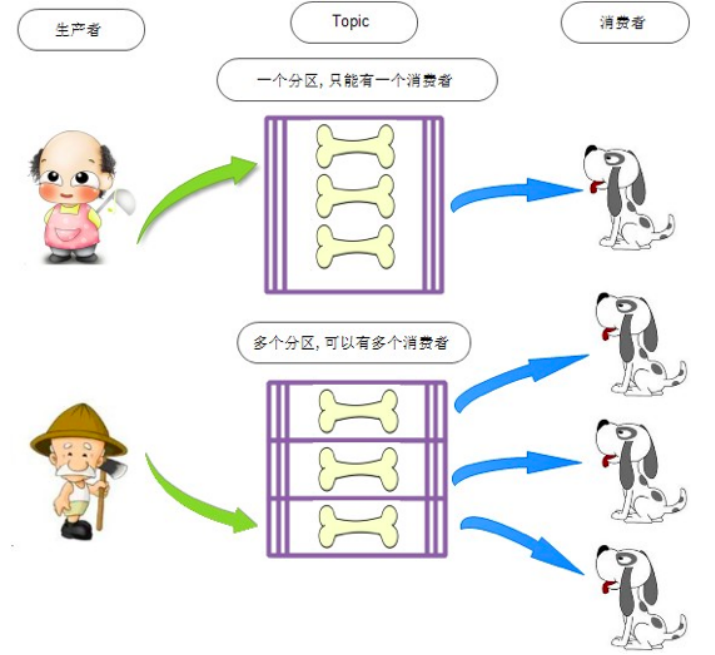
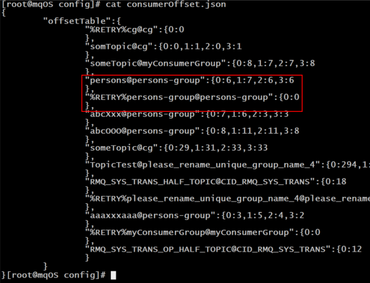
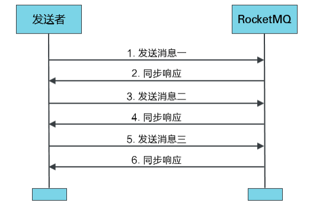

# Albrus-RocketMQ
(:3[▓▓▓▓▓▓▓▓]

> Systematically study the idea of RocketMQ and practice and record to deepen understanding.

## 第一章 RocketMQ 概述

### 一、MQ 概述

#### 1.1 MQ 简介

MQ，Message Queue，是一种提供**消息队列服务**的中间件，是一套提供了消息生产、存储、消费全过程 API 的软件系统。

#### 1.2 MQ 用途

##### 1.2.1 限流削峰

MQ 可以将系统的**超量**请求暂存其中，以便系统后期可以慢慢处理，避免系统请求的丢失或系统被压垮。


##### 1.2.2 异步解耦

上下游系统的调用若为同步调用，会大大降低系统的吞吐量和并发度，且系统耦合度太高。而异步调用则会解决这些问题，若两层系统之间想要从同步到异步的转化，一般做法是添加一个 MQ 层。


##### 1.2.3 数据收集

分布式系统会产生海量级数据了，如：业务日志、监控数据、用户行为等。针对这些数据流进行实时或批量采集汇总，然后对这些数据量进行大数据分析。

#### 1.3 常见 MQ 产品

##### 1.3.1 ActiveMQ

ActiveMQ 是使用 Java 语言开发一款 MQ 产品。早期很多公司与项目中都在使用。但现在的社区活跃度已经很低，现在的项目中已经很少使用了。

##### 1.3.2 RabbitMQ

RabbitMQ 是使用 ErLang 语言开发的一款 MQ 产品。其吞吐量较 Kafka 与 RocketMQ 要低，且由于其不是 Java 语言开发，所以公司内部对其实现定制化开发难度较大。

##### 1.3.3 Kafka

Kafka 是使用 Scala/Java 语言开发的一款 MQ 产品。其最大的特点就是**高吞吐率**，常用于大数据领域的实时计算、日志采集等场景。其没有遵循任何常见的 MQ 协议，而是使用**自研协议**。对于 Spring Cloud Netflix，其仅支持 RabbitMQ 与 Kafka。

##### 1.3.4 RocketMQ

RocketMQ 是使用Java语言开发的一款 MQ 产品。经过数年阿里双十一的考验，性能与稳定性非常高。其没有遵循任何常见的 MQ 协议，而是使用**自研协议**。对于 Spring Cloud Alibaba，其支持 RabbitMQ、 Kafka，但提倡使用 RocketMQ。

##### 1.3.5 对比

| 关键词     | ActiveMQ | RabbitMQ | Kafka                       | RocketMQ                    |
| ---------- | -------- | -------- | --------------------------- | --------------------------- |
| 开发语言   | Java     | ErLang   | Java                        | Java                        |
| 单机吞吐量 | 万级     | 万级     | 十万级                      | 十万级                      |
| Topic      | -        | -        | 百级 Topic 会影响系统吞吐量 | 千级 Topic 会影响系统吞吐量 |
| 社区活跃度 | 低       | 高       | 高                          | 高                          |

#### 1.4 MQ 常见协议

一般情况下 MQ 的实现要遵循一些常规性协议的。常见协议如下：

##### 1.4.1 JMS

JMS，Java Messaging Service（Java 消息服务）。是 Java 平台上有关 MOM（Message Oriented Middleware，面向消息的中间件 PO/OO/AO）的技术规范，它便于消息系统中的 Java 应用程序进行消息交换，并且通过提供标准的产生、发送、接收消息的接口，简化企业应用的开发。ActiveMQ 是该协议的典型实现。

##### 1.4.2 STOMP

STOMP，Streaming Text Orientated Message Protocol（面向流文本的消息协议），是一种 MOM 设计的简单文本协议。STOMP 提供一个可互操作的连接格式，允许客户端与任意 STOMP 消息代理（Broker）进行交互。ActiveMQ 是该协议的典型实现，RabbitMQ 通过插件可以支持该协议。

##### 1.4.3 AMOP

AMQP，Advanced Message Queuing Protocol（高级消息队列协议），一个提供统一消息服务的应用层标准，是应用层协议的一个开放标准，是一种 MOM 设计。基于此协议的客户端与消息中间件可传递消息，并不受客户端/中间件不同产品，不同开发语言等条件的限制。 RabbitMQ 是该协议的典型实现。

##### 1.4.4 MQTT

MQTT，Message Queuing Telemetry Transport（消息队列遥测传输），是 IBM 开发的一个即时通讯协议，是一种二进制协议，主要用于服务器和低功耗 IoT（物联网）设备间的通信。该协议支持所有平台，几乎可以把所有联网物品和外部连接起来，被用来当做传感器和致动器的通信协议。 RabbitMQ 通过插件可以支持该协议。

### 二、RocketMQ 概述


2017 年 9 ⽉ 25 ⽇，Apache 宣布 RocketMQ 孵化成为 Apache 顶级项⽬（TLP ），成为国内⾸个互联⽹中间件在 Apache 上的顶级项⽬。

## 第二章 RocketMQ 安装与启动

### 一、基本概念

#### 1.1 消息（Message）

消息是指，消息系统所传输信息的物理载体，生产和消费数据的最小单位，**每条消息必须属于一个主题**。

#### 1.2 主题（Topic）


Topic 表示**一类消息的集合**，**每个主题包含若干条消息，每条消息只能属于一个主题**，是 RocketMQ 进行消息订阅的基本单位。
`topic:message 1:n`、`message:topic 1:1`

**一个生产者可以同时发送多种 Topic 的消息；而一个消费者只对某种特定的 Topic 感兴趣**，即只可以订阅和消费一种 Topic 的消息。
`producer:topic 1:n`、`consumer:topic 1:1`

#### 1.3 标签（Tag）

为消息设置的标签，用于同一主题下区分不同类型的消息。来自同一业务单元的消息，可以根据不同业务目的在同一主题下设置不同标签。标签能够有效地保持代码的清晰度和连贯性，并优化 RocketMQ 提供的查询系统。消费者可以根据 Tag 实现对不同子主题的不同消费逻辑，实现更好的扩展性。

**Topic 是消息的一级分类，Tag 是消息的二级分类。**

Topic：货物 tag=上海 tag=江苏 tag=浙江

------- 消费者 -----

topic=货物 tag = 上海

topic=货物 tag = 上海|浙江

topic=货物 tag = *

#### 1.4 队列（Queue）

存储消息的物理实体。**一个 Topic 中可以包含多个 Queue**，每个 Queue 中存放的就是该 Topic 的消息。一个 Topic 的 Queue 也被称为一个 Topic 中消息的分区（Partition）。

**一个 Topic 的 Queue 中的消息只能被一个消费者组中的一个消费者消费。**一个 Queue 中的消息不允许同一个消费者组中的多个消费者同时消费。



（了解、非官方）在学习参考其它相关资料时，还会看到一个概念：分片（Sharding）。

分片不同于分区，在 RocketMQ 中，分片指的是存放相应 Topic 的 Broker，每个分片中会创建出相应数量的分区，即 Queue，每个 Queue 的大小都是相同的。


#### 1.5 消息标识（MessageId/Key）

RocketMQ 中每个消息拥有唯一的 MessageId，且可以携带具有业务标识的 Key，以方便对消息的查询。 不过需要注意的是，MessageId 有两个：在生产者 send() 消息时会自动生成一个 MessageId（`msgId`)， 当消息到达 Broker 后，Broker 也会自动生成一个 MessageId(`offsetMsgId`)。
`msgId`、`offsetMsgId` 与 Key 都称为消息标识。

- `msgId`：由producer端生成，其生成规则为：
  `producerIp + 进程pid + MessageClientIDSetter 类的 ClassLoader 的 hashCode + 当前时间 + AutomicInteger自增计数器`
- `offsetMsgId`：由 Broker 端生成，其生成规则为：
  `brokerIp + 物理分区的 offset（Queue 中的偏移量） `
- Key：由用户指定的业务相关的唯一标识

### 二、系统架构


RocketMQ 架构上主要分为四个部分：

#### 2.1 Producer

消息生产者，负责生产消息。Producer 通过 MQ 的负载均衡模块选择相应的 Broker 集群队列进行消息投递，**投递的过程支持快速失败并且低延迟**。

RocketMQ 中的消息生产者都是以生**产者组（Producer Group）**的形式出现的。生产者组是同一类生产者的集合，这类 Producer 发送相同 Topic 类型的消息。一个生产者组可以同时发送多个主题的消息。

#### 2.2 Consumer

消息消费者，负责消费消息。一个消息消费者会从 Broker 服务器中获取到消息，并对消息进行相关业务处理。

RocketMQ 中的消息消费者都是以**消费者组（Consumer Group）**的形式出现的。消费者组是同一类消费者的集合，这类 Consumer 消费的是同一个 Topic 类型的消息。消费者组使得在消息消费方面，实现**负载均衡**（将一个 Topic 中的不同的 Queue 平均分配给同一个 Consumer Group 的不同的 Consumer，注意，并不是将消息负载均衡）和**容错**（一个 Consumer 挂了，该 Consumer Group 中的其它 Consumer 可以接着消费原 Consumer 消费的 Queue）的目标变得非常容易。


消费者组中 Consumer 的数量应该**小于等于**订阅 Topic 的 Queue 数量。如果超出 Queue 数量，则多出的 Consumer 将不能消费消息。


不过，**一个 Topic 类型的消息可以被多个消费者组同时消费**。

- **消费者组只能消费一个 Topic 的消息**，不能同时消费多个 Topic 消息
- 一个消费者组中的消费者**必须订阅完全相同的 Topic**

#### 2.3 Name Server

##### 2.3.1 功能介绍

NameServer 是一个 Broker 与 Topic 路由的注册中心，支持 Broker 的动态注册与发现。

> RocketMQ 的思想来自于 Kafka，而 Kafka 是依赖了 Zookeeper 的。所以在 RocketMQ 的早期版本，即在 MetaQ v1.0 与 v2.0 版本中，也是依赖于 Zookeeper 的。从 MetaQ v3.0，即 RocketMQ 开始去掉了 Zookeeper 依赖，使用了自己的 NameServer。

主要包括两个功能：

- **Broker 管理**
  接受 Broker 集群的注册信息并且保存下来作为路由信息的基本数据；提供心跳检测机制，检查 Broker 是否还存活。
- **路由信息管理**：
  每个 NameServer 中都保存着 Broker 集群的整个路由信息和用于客户端查询的队列信息。Producer 和 Consumer 通过 NameServer 可以获取整个 Broker 集群的路由信息，从而进行消息的投递和消费。

##### 2.3.2 路由注册

NameServer 通常也是以集群的方式部署，不过，NameServer 是**无状态**的，即 NameServer 集群中的各个节点间是无差异的，各节点间相互不进行信息通讯。那各节点中的数据是如何进行数据同步的呢？**在 Broker 节点启动时，轮询 NameServer 列表，与每个 NameServer 节点建立长连接，发起注册请求。**在 NameServer 内部维护着⼀个 Broker 列表，用来动态存储 Broker 的信息。

> 这是与其它像 Zookeeper、Eureka、Nacos 等注册中心不同的地方。 这种 NameServer 的无状态方式：
>
> 优点：NameServer 集群**搭建简单，扩容简单**。
>
> 缺点：**对于 Broker，必须明确指出所有 NameServer 地址。**否则未指出的将不会去注册。也正因为如此，NameServer 并不能随便扩容。因为，若 Broker 不重新配置，新增的 NameServer 对于 Broker 来说是不可见的，其不会向这个 NameServer 进行注册。

Broker 节点为了证明自己是活着的，为了维护与 NameServer 间的长连接，会将最新的信息以**心跳包**的方式上报给 NameServer，每 30 秒发送一次心跳。心跳包中包含 Broker Id、Broker 地址(IP + Port)、 Broker 名称、Broker 所属集群名称等等。NameServer 在接收到心跳包后，会更新**心跳时间戳**，记录这个 Broker 的最新存活时间。

##### 2.3.3 路由剔除

由于 Broker 关机、宕机或网络抖动等原因，NameServer 没有收到 Broker 的心跳，NameServer 可能会将其从 Broker 列表中剔除。 NameServer 中有⼀个定时任务，每隔 10 秒就会扫描⼀次 Broker 表，查看每一个 Broker 的最新心跳时间戳距离当前时间是否超过 120 秒，如果超过，则会判定 Broker 失效，然后将其从 Broker 列表中剔除。

**扩展：**

对于 RocketMQ 日常运维工作，例如 Broker 升级，需要停掉 Broker 的工作。OP 需要怎么做？

**OP 需要将 Broker 的读写权限禁掉。**一旦 Client(Consumer/Producer)向 Broker 发送请求，都会收到 Broker 的 NO_PERMISSION 响应，然后 Client 会进行对其它 Broker 的重试。 当 OP 观察到这个 Broker 没有流量后，再关闭它，实现 Broker 从 NameServer 的移除。

> OP：运维工程师
>
> SRE：Site Reliability Engineer，现场可靠性工程师

##### 2.3.4 路由发现

RocketMQ 的路由发现采用的**是 Pull 模型**。
当 Topic 路由信息出现变化时，NameServer 不会主动推送给客户端，而是**客户端定时拉取主题最新的路由**。默认客户端每 30 秒会拉取一次最新的路由。

**扩展：**

1. Push 模型：推送模型
   **实时性较好**，是一个“发布-订阅”模型，需要维护一个长连接。而长连接的维护是需要资源成本的。
   该模型适合于的场景：实时性要求较高、Client 数量不多、Server 数据变化较频繁。
2. Pull模型：拉取模型
   存在的问题是，实时性较差。
3. Long Polling模型：长轮询模型
   对 Push 与 Pull 模型的整合（Server hold 一段时间连接，并不马上断开连接），充分利用了这两种模型的优势，屏蔽了它们的劣势。

##### 2.3.5 客户端 Name Server 选择策略

> 这里的客户端指的是 Producer 与 Consumer

客户端在配置时必须要写上 NameServer 集群的地址，那么客户端到底连接的是哪个 NameServer 节点呢？
客户端首先会生产一个**随机数**，然后再与 NameServer **节点数量取模**，此时得到的就是所要连接的**节点索引**，然后就会进行连接。如果连接失败，则会采用 Round-Robin 策略，逐个尝试着去连接其它节点。

首先采用的是**随机策略**进行的选择，失败后采用的是**轮询策略**。

**扩展：**

Zookeeper Client 是如何选择 Zookeeper Server 的？

简单来说就是，经过两次 Shuffle，然后选择第一台 Zookeeper Server。
详细说就是，将配置文件中的 Zookeeper Server 地址进行第一次 Shuffle，然后随机选择一个。这个选择出的一般都是一个 hostname。然后获取到该 hostname 对应的所有 IP，再对这些 IP 进行第二次 Shuffle，从 Shuffle 过的结果中取第一个 Server 地址进行连接。

#### 2.4 Broker

##### 2.4.1 功能介绍

Broker 充当着消息中转角色，负责**存储、转发**消息。
Broker 在 RocketMQ 系统中负责接收并存储从生产者发送来的消息，同时为消费者的拉取请求作准备。Broker 同时也存储着消息相关的元数据，包括消费者组消费进度偏移 offset、主题、队列等。

> Kafka 0.8 版本之后，offset 是存放在 Broker 中的，之前版本是存放在 Zookeeper 中。

##### 2.4.2 模块构成


**Remoting Module**：整个Broker的实体，负责处理来自 Client 端的请求。而这个 Broker 实体则由以下模块构成：

**Client Manager**：客户端管理器。负责接收、解析客户端(Producer/Consumer)请求，管理客户端。例如，维护 Consumer 的 Topic 订阅信息

**Store Service**：存储服务。提供方便简单的 API 接口，处理消息存储到物理硬盘和消息查询功能

**HA Service**：高可用服务，提供 Master Broker 和 Slave Broker 之间的数据同步功能

**Index Service**：索引服务。根据特定的 Message Key，对投递到 Broker 的消息进行索引服务，同时也提供根据 Message Key 对消息进行快速查询的功能

##### 2.4.3 集群部署


为了增强 Broker 性能与吞吐量，Broker 一般都是以集群形式出现的。各集群节点中可能存放着相同 Topic 的不同 Queue。

不过，这里有个问题，如果某 Broker 节点宕机，如何保证数据不丢失呢？
其解决方案是，将每个 Broker 集群节点进行横向扩展，即将 Broker 节点再建为一个 HA 集群，解决单点问题。 

Broker节点集群是一个主从集群，即集群中具有 Master 与 Slave 两种角色。Master 负责处理读写操作请求，Slave 负责对 Master 中的数据进行备份。当 Master 挂掉了，Slave 则会自动切换为 Master 去工作。所以这个 Broker 集群是主备集群。一个 Master 可以包含多个 Slave，但一个 Slave 只能隶属于一个 Master。 Master 与 Slave 的对应关系是通过指定相同的 Broker Name、不同的 Broker Id 来确定的。Broker Id 为 0 表示 Master，非 0 表示 Slave。每个 Broker 与 NameServer 集群中的所有节点建立长连接，定时注册 Topic 信息到所有 NameServer。

#### 2.5 工作流程

##### 2.5.1 具体流程

1. 启动 NameServer，NameServer 启动后开始监听端口，等待 Broker、Producer、Consumer 连接。
2. 启动 Broker 时，Broker 会与所有的 NameServer 建立并保持长连接，然后每 30 秒向 NameServer 定时发送心跳包。
3. 发送消息前，可以先创建 Topic，创建 Topic 时需要指定该 Topic 要存储在哪些 Broker 上。当然，在创建 Topic 时也会将 Topic 与 Broker 的关系写入到NameServer中。不过，这步是可选的。也可以在发送消 息时自动创建Topic。
4. Producer发送消息，启动时先跟 NameServer 集群中的其中一台建立长连接，并从 NameServer 中获取路由信息，即当前发送的 Topic 消息的 Queue 与 Broker 的地址（IP+Port）的映射关系。然后根据算法策略从队选择一个 Queue，与队列所在的 Broker 建立长连接从而向 Broker 发消息。当然，在获取到路由信息后，Producer 会首先将路由信息缓存到本地，再每 30 秒从 NameServer 更新一次路由信息。
5. Consumer 跟 Producer 类似，跟其中一台 NameServer 建立长连接，获取其所订阅 Topic 的路由信息，然后根据算法策略从路由信息中获取到其所要消费的 Queue，然后直接跟 Broker 建立长连接，开始消费其中的消息。Consumer 在获取到路由信息后，同样也会每 30 秒从 NameServer 更新一次路由信息。不过不同于 Producer 的是，Consumer 还会向 Broker 发送心跳，以确保 Broker 的存活状态。

##### 2.5.2 Topic 创建模式

手动创建 Topic，有两种模式：

- 集群模式：创建的 Topic 在该集群中，所有 Broker 中的 Queue 数量是相同的
- Broker 模式：创建的 Topic 在该集群中，每个 Broker 中的 Queue 数量可以不同

自动创建 Topic 时，默认是 Broker 模式，会为每个 Broker 默认创建 4 个 Queue。

##### 2.5.3 读/写队列

**从物理上来讲，读/写队列是同一个队列。**读/写队列是**逻辑**上进行区分的概念。一般情况下，读/写队列数量是相同的。

例如，创建 Topic 时设置的写队列数量为 8，读队列数量为 4，此时系统会创建 8 个 Queue，分别是 0 1 2 3 4 5 6 7。
Producer 会将消息写入到这 8 个队列，但 Consumer 只会消费 0 1 2 3 这 4 个队列中的消息，4 5 6 7 中的消息是不会被消费到的。

再如，创建 Topic 时设置的写队列数量为 4，读队列数量为 8，此时系统会创建 8 个 Queue，分别是 0 1 2 3 4 5 6 7。
Producer 只会将消息写入到 0 1 2 3 这 4 个队列，但 Consumer 会消费 0 1 2 3 4 5 6 7 这 8 个队列中的消息，但是 4 5 6 7 中是没有消息的。此时假设 Consumer Group 中包含两个 Consumer，Consumer 1 消费 0 1 2 3，而 Consumer 2 消费 4 5 6 7。但实际情况是，Consumer 2 是没有消息可消费的。

也就是说，当读/写队列数量设置不同时，总是有问题的。那么，为什么要这样设计呢？
其这样设计的目的是为了，**方便 Topic 的 Queue 的缩容**。

**例如，原来创建的 Topic 中包含 16 个 Queue，如何能够使其 Queue 缩容为 8 个，还不会丢失消息？**
可以动态修改**写队列**数量为 8，读队列数量不变。此时新的消息只能写入到前 8 个队列，而消费都消费的却是 16 个队列中的数据。当发现后 8 个 Queue 中的消息消费完毕后，就可以再将**读队列**数量动态设置为 8。整个缩容过程，没有丢失任何消息。

perm 用于设置对当前创建 Topic 的操作权限：2 表示只写，4 表示只读，6 表示读写。

### 三、单机安装与启动

#### 3.1 环境要求

The following softwares are assumed installed:

1. 64bit OS, Linux/Unix/Mac is recommended;(Windows user see guide below)
2. 64bit JDK 1.8+;
3. Maven 3.2.x;
4. Git;
5. 4g+ free disk for Broker server

RocketMQ 版本：**rocketmq-all-4.9.4-bin-release.zip**

#### 3.2 修改初始内存

1. runnserver.sh

   ```bash
   choose_gc_options()
   {
       # Example of JAVA_MAJOR_VERSION value : '1', '9', '10', '11', ...
       # '1' means releases befor Java 9
       JAVA_MAJOR_VERSION=$("$JAVA" -version 2>&1 | sed -r -n 's/.* version "([0-9]*).*$/\1/p')
       if [ -z "$JAVA_MAJOR_VERSION" ] || [ "$JAVA_MAJOR_VERSION" -lt "9" ] ; then
         # JAVA_OPT="${JAVA_OPT} -server -Xms4g -Xmx4g -Xmn2g -XX:MetaspaceSize=128m -XX:MaxMetaspaceSize=320m"
         JAVA_OPT="${JAVA_OPT} -server -Xms256m -Xmx256m -Xmn128m -XX:MetaspaceSize=128m -XX:MaxMetaspaceSize=320m"
         JAVA_OPT="${JAVA_OPT} -XX:+UseConcMarkSweepGC -XX:+UseCMSCompactAtFullCollection -XX:CMSInitiatingOccupancyFraction=70 -XX:+CMSParallelRemarkEnabled -XX:SoftRefLRUPolicyMSPerMB=0 -XX:+CMSClassUnloadingEnabled -XX:SurvivorRatio=8 -XX:-UseParNewGC"
         JAVA_OPT="${JAVA_OPT} -verbose:gc -Xloggc:${GC_LOG_DIR}/rmq_srv_gc_%p_%t.log -XX:+PrintGCDetails -XX:+PrintGCDateStamps"
         JAVA_OPT="${JAVA_OPT} -XX:+UseGCLogFileRotation -XX:NumberOfGCLogFiles=5 -XX:GCLogFileSize=30m"
       else
         JAVA_OPT="${JAVA_OPT} -server -Xms4g -Xmx4g -XX:MetaspaceSize=128m -XX:MaxMetaspaceSize=320m"
         JAVA_OPT="${JAVA_OPT} -XX:+UseG1GC -XX:G1HeapRegionSize=16m -XX:G1ReservePercent=25 -XX:InitiatingHeapOccupancyPercent=30 -XX:SoftRefLRUPolicyMSPerMB=0"
         JAVA_OPT="${JAVA_OPT} -Xlog:gc*:file=${GC_LOG_DIR}/rmq_srv_gc_%p_%t.log:time,tags:filecount=5,filesize=30M"
       fi
   }
   ```

   `-Xms4g -Xmx4g -Xmn2g` -> `-Xms256m -Xmx256m -Xmn128m`

2. runbroker.sh

   ```bash
   # JAVA_OPT="${JAVA_OPT} -server -Xms8g -Xmx8g"
   JAVA_OPT="${JAVA_OPT} -server -Xms512m -Xmx512m"
   choose_gc_options
   JAVA_OPT="${JAVA_OPT} -XX:-OmitStackTraceInFastThrow"
   JAVA_OPT="${JAVA_OPT} -XX:+AlwaysPreTouch"
   JAVA_OPT="${JAVA_OPT} -XX:MaxDirectMemorySize=15g"
   JAVA_OPT="${JAVA_OPT} -XX:-UseLargePages -XX:-UseBiasedLocking"
   #JAVA_OPT="${JAVA_OPT} -Xdebug -Xrunjdwp:transport=dt_socket,address=9555,server=y,suspend=n"
   JAVA_OPT="${JAVA_OPT} ${JAVA_OPT_EXT}"
   JAVA_OPT="${JAVA_OPT} -cp ${CLASSPATH}"
   ```

   `-Xms8g -Xmx8g` -> `-Xms512m -Xmx512m`

#### 3.3 启动

##### 3.3.1 启动 NameServer

```bash
nohup sh bin/mqnamesrv &
tail -f ~/logs/rocketmqlogs/namesrv.log
The Name Server boot success...
```

##### 3.3.2 启动 Broker

```bash
nohup sh bin/mqbroker -n localhost:9876 &
tail -f ~/logs/rocketmqlogs/broker.log 
The broker[%s, 172.30.30.233:10911] boot success...
```

##### 3.3.3 发送/接收消息

```bash
export NAMESRV_ADDR=localhost:9876
sh bin/tools.sh org.apache.rocketmq.example.quickstart.Producer
SendResult [sendStatus=SEND_OK, msgId= ...

sh bin/tools.sh org.apache.rocketmq.example.quickstart.Consumer
ConsumeMessageThread_%d Receive New Messages: [MessageExt...
```

##### 3.3.4 关闭服务

**无论是关闭 NameServer 还是 Broker，都是使用 `bin/mqshutdown` 命令：**

```bash
sh bin/mqshutdown broker
The mqbroker(36695) is running...
Send shutdown request to mqbroker(36695) OK

sh bin/mqshutdown namesrv
The mqnamesrv(36664) is running...
Send shutdown request to mqnamesrv(36664) OK
```

#### 3.4 可视化控制台

> https://github.com/apache/rocketmq-externals

### 四、集群搭建理论


#### 4.1 数据复制与刷盘策略


复制：主机 -> 注解

刷盘：内存 -> 磁盘

##### 4.1.2 复制策略

复制策略**是 Broker 的 Master 与 Slave 间的数据同步方式**。分为同步复制与异步复制：

- 同步复制：消息写入 Master 后，**Master 会等待** Slave 同步数据成功后才向 Producer 返回成功 ACK
- 异步复制：消息写入 Master 后，**Master 立即**向 Producer 返回成功 ACK，无需等待 Slave 同步数据成功

> **异步复制策略会降低系统的写入延迟，RT 变小，提高了系统的吞吐量**

##### 4.1.3 刷盘策略

刷盘策略指的是 Broker 中消息的**落盘**方式，即消息发送到 Broker 内存后消息**持久化**到磁盘的方式。分为同步刷盘与异步刷盘：

- 同步刷盘：当消息持久化到 Broker 的磁盘后才算是消息写入成功
- 异步刷盘：当消息写入到 Broker 的内存后即表示消息写入成功，无需等待消息持久化到磁盘

> 1）异步刷盘策略会降低系统的写入延迟，RT 变小，提高了系统的吞吐量
>
> 2）消息写入到 Broker 的内存，一般是写入到了 PageCache
>
> 3）对于异步刷盘策略，消息会写入到 PageCache 后立即返回成功 ACK，但并不会立即做落盘操作，而是当 PageCache 到达一定量时会自动进行落盘

#### 4.2 Broker 集群模式

根据 Broker 集群中各个节点间关系的不同，Broker 集群可以分为以下几类：

##### 4.2.1 单 Master

也就是**单机**，只有一个 Master（本质上不能称之为集群），存在**单点问题**。

##### 4.2.2 多 Master

Broker 由多个 Master 构成，不存在 Slave。
同一个 Topic 的各个 Queue 会平均分布在各个 Master 节点。

优点：配置简单，单个 Master 宕机或重启维护对应用无影响，在磁盘配置为 RAID10 时，即使机器宕机不可恢复情况下，由于 RAID10 磁盘非常可靠，消息也不会丢（**异步刷盘丢失少量消息，同步刷盘一条不丢**），性能最高

缺点：单台机器**宕机**期间，这台机器上未被消费的消息在机器恢复之前不可订阅（不可消费），**消息实时性会受到影响**

> 以上优点的前提是，这些 Master 都配置了 RAID 磁盘阵列。
> 如果没有配置，一旦出现某 Master 宕机，则会发生大量消息丢失的情况。

##### 4.2.3 多 Master、多 Slave + 异步复制

**Broker 集群由多个 Master 构成，每个 Master 又配置了多个 Slave**（在配置了 RAID 磁盘阵列的情况下，一个 Master 一般配置一个 Slave 即可）。
Master 与 Slave 的关系是**主备**关系，**即 Master 负责**处理消息的**读写**请求，**而 Slave 仅负责**消息的**备份**与 Master 宕机后的**角色切换**。

**异步复制**：消息写入 Master 成功后，Master 会立即向 Producer 返回成功 ACK，而不会等待 Slave 同步数据成功。

该模式的最大特点之一是：当 Master 宕机后 Slave 能够自动切换为 Master。
不过由于 Slave 从 Master 的同步具有短暂的延迟（毫秒级），所以当 Master 宕机后，这种异步复制方式可能会存在**少量消息的丢失问题**。

> Slave 从 Master 同步的延迟越短，其可能丢失的消息就越少。
>
> 对于 Master 的 RAID 磁盘阵列，若使用的也是异步复制策略，同样也存在延迟问题，同样也可能会丢失消息。
> 但 RAID 阵列的秘诀是微秒级的（因为是由硬盘支持的），所以其丢失的数据量会更少。

##### 4.2.4 多 Master、多 Slave + 同步双写

该模式是**多 Master 多 Slave 模式的同步复制**实现。

所谓同步双写，指的是消息写入 Master 成功后，Master 会**等待** Slave 同步数据成功后才向 Producer 返回成功 ACK，即 Master 与 Slave 都要写入成功后才会 返回成功 ACK，也即**双写**。

该模式与异步复制模式相比，优点是**消息的安全性更高**，不存在消息丢失的情况。但单个消息的 RT 略高，从而导致性能要略低（大约低 10%）。
该模式存在一个大的问题：**对于目前的版本，Master 宕机后，Slave 不会自动切换到 Master。**

##### 4.2.5 最佳实践

一般会为 Master 配置 RAID10 磁盘阵列，然后再为其配置一个 Slave。即利用了 RAID10 磁盘阵列的高效、安全性，又解决了可能会影响订阅的问题。

- RAID 磁盘阵列的效率要高于 Master-Slave 集群。因为 RAID 是硬件支持的。也正因为如此，所以 RAID 阵列的搭建成本较高
- 多 Master+RAID 阵列，与多 Master 多 Slave 集群的区别是什么？
  - 多 Master+RAID 阵列，其**仅仅可以保证数据不丢失**，即不影响消息写入，但其可能会（宕机）影响到消息的订阅。但其执行效率要远高于多 Master、多 Slave 集群
  - 多 Master、多 Slave 集群，其不仅可以保证数据不丢失，也不会影响消息订阅。但其运行效率要低于多 Master+RAID 阵列

### 五、磁盘阵列

#### 5.1 RAID 历史

1988 年美国加州大学伯克利分校的 D.A.Patterson 教授等首次在论文“A Case of Redundant Array of Inexpensive Disks”中提出了 RAID 概念 ，即**廉价冗余磁盘阵列（Redundant Array of Inexpensive Disks）**。由于当时大容量磁盘比较昂贵， RAID 的基本思想是将多个容量较小、相对廉价的磁盘进行有机组合，从而以较低的成本获得与昂贵大容量磁盘相当的**容量、性能、可靠性**。随着磁盘成本和价格的不断降低，“廉价”已经毫无意义。因此，RAID 咨询委员会（RAID Advisory Board, RAB）决定用“独立”替代“廉价” ，于时 RAID 变成了**独立磁盘冗余阵列（Redundant Array of Independent Disks）**。但这仅仅是名称的变化，实质内容没有改变。

#### 5.2 RAID 等级

RAID 这种设计思想很快被业界接纳，RAID 技术作为高性能、高可靠的存储技术，得到了非常广泛的应用。RAID 主要利用**镜像、数据条带和数据校验**三种技术来获取**高性能、可靠性、容错能力和扩展性**，根据对这三种技术的使用策略和组合架构，可以把 RAID 分为不同的等级，以满足不同数据应用的需求。

D.A.Patterson 等的论文中定义了 RAID0~RAID6 原始 RAID 等级。随后存储厂商又不断推出 RAID7、RAID10、RAID01、RAID50、RAID53、RAID100 等 RAID 等级，但这些并无统一的标准。目前**业界与学术界公认的标准是 RAID0~RAID6，而在实际应用领域中使用最多的 RAID 等级是 RAID0、RAID1、RAID3、RAID5、RAID6 和 RAID10**。

RAID 每一个等级代表一种实现方法和技术，等级之间并无高低之分。在实际应用中，应当根据用户的数据应用特点，综合考虑可用性、性能和成本来选择合适的 RAID 等级，以及具体的实现方式。

#### 5.3 关键技术

##### 5.3.1 镜像

镜像技术是一种冗余技术，为磁盘提供数据备份功能，防止磁盘发生故障而造成数据丢失。对于 RAID 而言，采用镜像技术最典型地的用法就是：同时在磁盘阵列中产生两个完全相同的数据副本，并且分布在两个不同的磁盘上。镜像提供了完全的数据冗余能力，当一个数据副本失效不可用时，外部系统仍可正常访问另一副本，不会对应用系统运行和性能产生影响。而且，镜像不需要额外的计算和校验，故障修复非常快，直接复制即可。镜像技术可以从多个副本进行并发读取数据，提供更高的读 I/O 性能，但不能并行写数据，写多个副本通常会导致一定的 I/O 性能下降。

镜像技术提供了非常高的数据安全性，其代价也是非常昂贵的，需要至少双倍的存储空间。高成本限制了镜像的广泛应用，主要应用于至关重要的数据保护，这种场合下的数据丢失可能会造成非常巨大的损失。

##### 5.3.2 数据条带

数据条带化技术是一种自动**将 I/O 操作负载均衡到多个物理磁盘上**的技术。更具体地说就是，将一块连续的数据分成很多小部分并把它们**分别存储到不同磁盘上**。这就能使多个进程可以**并发访问数据的多个不同部分**，从而获得最大程度上的 I/O 并行能力，极大地提升性能。

##### 5.3.3 数据校验

数据校验技术是指，RAID 要在写入数据的同时进行校验计算，并将得到的校验数据存储在 RAID 成员磁盘中。校验数据可以集中保存在某个磁盘或分散存储在多个不同磁盘中。当其中一部分数据出错时，就可以对剩余数据和校验数据进行反校验计算重建丢失的数据。

数据校验技术相对于镜像技术的优势在于节省大量开销，但由于**每次数据读写都要进行大量的校验运算**，对计算机的运算速度要求很高，且必须使用硬件 RAID 控制器。在数据重建恢复方面，**检验技术比镜像技术复杂得多且慢得多**。

#### 5.4 RAID 分类

> 从实现角度看，RAID 主要分为软 RAID、硬 RAID 以及混合 RAID 三种。

##### 5.4.1 软 RAID

所有功能均**由操作系统和 CPU 来完成**，没有独立的 RAID 控制处理芯片和 I/O 处理芯片，效率自然最低。

##### 5.4.2 硬 RAID

配备了专门的 RAID 控制处理芯片和 I/O 处理芯片以及阵列缓冲，不占用 CPU 资源。效率很高，但成本也很高。

##### 5.4.3 混合 RAID

具备 RAID 控制处理芯片，但没有专门的I/O 处理芯片，需要 CPU 和驱动程序来完成。性能和成本在软 RAID 和硬 RAID 之间。

#### 5.5 常见 RAID 等级详解

##### 5.5.1 JBOD


JBOD ，Just a Bunch of Disks，**磁盘簇**。表示一个没有控制软件提供协调控制的磁盘集合，这是 RAID 区别与 JBOD 的主要因素。
**JBOD 将多个物理磁盘串联起来，提供一个巨大的逻辑磁盘。**

JBOD 的数据存放机制是由第一块磁盘开始按顺序往后存储，当前磁盘存储空间用完后，再依次往后面的磁盘存储数据。 JBOD 存储性能完全等同于单块磁盘，而且也不提供数据安全保护（扩容、磁盘柜）。

JBOD 常指磁盘柜，而不论其是否提供 RAID 功能。不过，JBOD 并非官方术语，官方称为 Spanning。

##### 5.5.2 RAID0


RAID0 是一种简单的、无数据校验的**数据条带化**技术。实际上不是一种真正的 RAID ，因为它并**不提供任何形式的冗余策略**。 RAID0 将所在磁盘条带化后组成大容量的存储空间，**将数据分散存储在所有磁盘中，以独立访问方式实现多块磁盘的并读访问**。

理论上讲，一个由 n 块磁盘组成的 RAID0 ，它的读写性能是单个磁盘性能的 n 倍，但由于总线带宽等多种因素的限制，实际的性能提升低于理论值。由于可以**并发执行 I/O 操作，总线带宽得到充分利用**。再加上不需要进行数据校验，RAID0 的性能在所有 RAID 等级中是最高的。

RAID0 具有低成本、高读写性能、100% 的高存储空间利用率等优点，但是它不提供数据冗余保护，一旦数据损坏，将无法恢复。

应用场景：对数据的顺序读写要求不高，对数据的安全性和可靠性要求不高，但对系统性能要求很高的场景。

##### 5.5.3 RAID1


RAID1 就是一种**镜像技术**，它将数据完全一致地分别写到**工作磁盘和镜像磁盘**，它的磁盘空间利用率为 50%。 RAID1 在数据写入时，响应时间会有所影响，但是读数据的时候没有影响。RAID1 提供了最佳的数据保护，一旦工作磁盘发生故障，系统将自动切换到镜像磁盘，不会影响使用。

RAID1 是为了增强数据安全性使两块磁盘数据呈现完全镜像，从而达到安全性好、技术简单、管理方便。 RAID1 拥有完全容错的能力，但实现成本高。

应用场景：对顺序读写性能要求较高，或对数据安全性要求较高的场景。

##### 5.5.4 RAID10


RAID10 是一个 RAID1 与 RAID0 的组合体，所以它继承了 RAID0 的快速和 RAID1 的安全。

简单来说就是，**先做条带、再做镜像**。即将进来的数据先分散到不同的磁盘，再将磁盘中的数据做镜像。

##### 5.5.5 RAID01


RAID01是一个 RAID0 与 RAID1 的组合体，所以它继承了 RAID0 的快速和 RAID1 的安全。

简单来说就是，**先做镜像、再做条带**。即将进来的数据先做镜像，再将镜像数据写入到与之前数据不同的磁盘，即再做条带。

> RAID10 要比 RAID01 的容错率高，所以生产环境下一般是不使用 RAID01。

### 六、集群搭建

双主双从异步复制的 Broker 集群，可以仅使用两台设备完成搭建：

| 序号 | IP           | 功能                | BROKER 角色      |
| ---- | ------------ | ------------------- | ---------------- |
| 1    | 10.10.20.134 | NameServer + Broker | Master1 + Slave2 |
| 2    | 10.10.20.136 | NameServer + Broker | Master2 + Slave1 |

- Master1 + Slave2/Master2 + Slave1 交叉配置：一台设备宕机才不影响使用

**配置参考：**

```properties
#指定整个broker集群的名称，或者说是RocketMQ集群的名称
brokerClusterName=rocket-MS
#指定master-slave集群的名称。一个RocketMQ集群可以包含多个master-slave集群
brokerName=broker-a
#0 表示 Master，>0 表示 Slave
brokerId=0
#nameServer地址，分号分割
namesrvAddr=nameserver1:9876;nameserver2:9876
#默认为新建Topic所创建的队列数
defaultTopicQueueNums=4
#是否允许 Broker 自动创建Topic，建议生产环境中关闭
autoCreateTopicEnable=true
#是否允许 Broker 自动创建订阅组，建议生产环境中关闭
autoCreateSubscriptionGroup=true
#Broker对外提供服务的端口，即Broker与producer与consumer通信的端口
listenPort=10911
#HA高可用监听端口，即Master与Slave间通信的端口，默认值为listenPort+1
haListenPort=10912
#指定删除消息存储过期文件的时间为凌晨4点
deleteWhen=04
#指定未发生更新的消息存储文件的保留时长为48小时，48小时后过期，将会被删除
fileReservedTime=48
#指定commitLog目录中每个文件的大小，默认1G
mapedFileSizeCommitLog=1073741824
#指定ConsumeQueue的每个Topic的每个Queue文件中可以存放的消息数量，默认30w条
mapedFileSizeConsumeQueue=300000
#在清除过期文件时，如果该文件被其他线程所占用（引用数大于0，比如读取消息），此时会阻止此次删除任务，同时在第一次试图删除该文件时记录当前时间戳。该属性则表示从第一次拒绝删除后开始计时，该文件最多可以保留的时长。在此时间内若引用数仍不为0，则删除仍会被拒绝。不过时间到后，文件将被强制删除
destroyMapedFileIntervalForcibly=120000
#指定commitlog、consumequeue所在磁盘分区的最大使用率，超过该值，则需立即清除过期文件
diskMaxUsedSpaceRatio=88
#指定store目录的路径，默认在当前用户主目录中
storePathRootDir=/usr/local/rocketmq-all-4.5.0/store
#commitLog目录路径
storePathCommitLog=/usr/local/rocketmq-all-4.5.0/store/commitlog
#consumeueue目录路径
storePathConsumeQueue=/usr/local/rocketmq-all-4.5.0/store/consumequeue
#index目录路径
storePathIndex=/usr/local/rocketmq-all-4.5.0/store/index
#checkpoint文件路径
storeCheckpoint=/usr/local/rocketmq-all-4.5.0/store/checkpoint
#abort文件路径
abortFile=/usr/local/rocketmq-all-4.5.0/store/abort
#指定消息的最大大小
maxMessageSize=65536
#Broker的角色
# - ASYNC_MASTER 异步复制Master
# - SYNC_MASTER 同步双写Master
# - SLAVE
brokerRole=SYNC_MASTER
#刷盘策略
# - ASYNC_FLUSH 异步刷盘
# - SYNC_FLUSH 同步刷盘
flushDiskType=SYNC_FLUSH
#发消息线程池数量
sendMessageThreadPoolNums=128
#拉消息线程池数量
pullMessageThreadPoolNums=128
#强制指定本机IP，需要根据每台机器进行修改。官方介绍可为空，系统默认自动识别，但多网卡时IP地址可能读取错误
brokerIP1=192.168.3.105
```

#### 6.1 设备1

> 在 conf/2m-2s-async 目录下修改配置：

`broker-a.properties`:

```properties
# 指定整个broker集群的名称，或者说是RocketMQ集群的名称
brokerClusterName=DefaultCluster
# 指定master-slave集群的名称。一个RocketMQ集群可以包含多个master-slave集群
brokerName=broker-a
# master的brokerId为0
brokerId=0
# 指定删除消息存储过期文件的时间为凌晨4点
deleteWhen=04
# 指定未发生更新的消息存储文件的保留时长为48小时，48小时后过期，将会被删除
fileReservedTime=48
# 指定当前broker为异步复制master
brokerRole=ASYNC_MASTER
# 指定刷盘策略为异步刷盘
flushDiskType=ASYNC_FLUSH
# 指定Name Server的地址
namesrvAddr=192.168.59.164:9876;192.168.59.165:9876
```

`broker-b-s.properties`:

```properties
brokerClusterName=DefaultCluster
# 指定这是另外一个master-slave集群
brokerName=broker-b
# slave的brokerId为非0
brokerId=1
deleteWhen=04
fileReservedTime=48
# 指定当前broker为slave
brokerRole=SLAVE
flushDiskType=ASYNC_FLUSH
namesrvAddr=192.168.59.164:9876;192.168.59.165:9876
# 指定Broker对外提供服务的端口，即Broker与producer与consumer通信的端口。默认10911。由于当前主机同时充当着master1与slave2，而前面的master1使用的是默认端口。这里需要将这两个端口加以区分，以区分出master1与slave2
listenPort=11911
# 指定消息存储相关的路径。默认路径为~/store目录。由于当前主机同时充当着master1与slave2，master1使用的是默认路径，这里就需要再指定一个不同路径
storePathRootDir=~/store-s
storePathCommitLog=~/store-s/commitlog
storePathConsumeQueue=~/store-s/consumequeue
storePathIndex=~/store-s/index
storeCheckpoint=~/store-s/checkpoint
abortFile=~/store-s/abort
```

#### 6.2 设备2

> 在 conf/2m-2s-async 目录下修改配置：

`broker-b.properties`:

```properties
brokerClusterName=DefaultCluster
brokerName=broker-b
brokerId=0
deleteWhen=04
fileReservedTime=48
brokerRole=ASYNC_MASTER
flushDiskType=ASYNC_FLUSH
namesrvAddr=192.168.59.164:9876;192.168.59.165:9876
```

`broker-a-s.properties`:

```properties
brokerClusterName=DefaultCluster
brokerName=broker-a
brokerId=1
deleteWhen=04
fileReservedTime=48
brokerRole=SLAVE
flushDiskType=ASYNC_FLUSH
namesrvAddr=192.168.59.164:9876;192.168.59.165:9876
listenPort=11911
storePathRootDir=~/store-s
storePathCommitLog=~/store-s/commitlog
storePathConsumeQueue=~/store-s/consumequeue
storePathIndex=~/store-s/index
storeCheckpoint=~/store-s/checkpoint
abortFile=~/store-s/abort
```

#### 6.3 启动集群

**启动 NameServer 集群**

```bash
# 分别启动两台设备的 NameServer
nohup sh bin/mqnamesrv &
tail -f ~/logs/rocketmqlogs/namesrv.log
```

**启动两个 Master**

```bash
nohup sh bin/mqbroker -c conf/2m-2s-async/broker-a.properties &
tail -f ~/logs/rocketmqlogs/broker.log

nohup sh bin/mqbroker -c conf/2m-2s-async/broker-b.properties &
tail -f ~/logs/rocketmqlogs/broker.log
```

**启动两个 Slave**

```bash
nohup sh bin/mqbroker -c conf/2m-2s-async/broker-a-s.properties &
tail -f ~/logs/rocketmqlogs/broker.log

nohup sh bin/mqbroker -c conf/2m-2s-async/broker-b-s.properties &
tail -f ~/logs/rocketmqlogs/broker.log
```

### 七、mqadmin

> 在 RocketMQ 解压目录的 bin 目录下有一个 `mqadmin` 命令，该命令是一个运维指令，用于对 RocketMQ 的主题、集群、Broker 等信息进行管理。

[参考GitHub](https://github.com/apache/rocketmq/blob/master/docs/cn/operation.md#2-mqadmin%E7%AE%A1%E7%90%86%E5%B7%A5%E5%85%B7)

## 第三章 RocketMQ 工作原理

### 一、消息生产

#### 1.1 消息生产过程

Producer 可以将消息写入到某 Broker 中的某 Queue 中，其经历了如下过程：

- Producer 发送消息之前，会先向 NameServer 发出获取消息 Topic 的**路由信息**的请求
- NameServer 返回该 Topic 的**路由表及 Broker 列表**
  - 路由表：实际是一个 `Map`，key 为 Topic 名称，value 是一个 QueueData 实例列表。
    QueueData 并不是一个 Queue 对应一个 QueueData，而是一个 Broker 中该 Topic 的所有 Queue 对应一个 QueueData。即，只要涉及到该 Topic 的 Broker，一个 Broker 对应一个 QueueData。QueueData 中包含 BrokerName。简单来说，路由表的 key 为 Topic 名称，value 则为所有涉及该Topic 的 BrokerName 列表
  - Broker列表：其实际也是一个 `Map`，key 为 BrokerName，value 为 BrokerData。
    一个 Broker 对应一个 BrokerData 实例，对吗？不对。**一套 BrokerName 名称相同的 Master-Slave 小集群对应一个 BrokerData**。BrokerData 中包含 BrokerName 及一个 `Map`。该 `Map` 的 key 为 BrokerId，value 为该 Broker 对应的地址。BrokerId 为 0 表示该 Broker 为 Master，非 0 表示 Slave
- Producer 根据代码中指定的 Queue 选择策略，从 Queue 列表中选出一个队列，用于后续存储消息
- Producer 对消息做一些特殊处理，例如，消息本身超过 4M，则会对其进行压缩
- Producer 向选择出的 Queue 所在的 Broker 发出 RPC 请求，将消息发送到选择出的 Queue

#### 1.2 Queue 选择算法

对于无序消息，其 Queue 选择算法，也称为消息投递算法，常见的有两种：

##### 1.2.1 轮询算法

**默认选择算法**。该算法保证了每个 Queue 中可以均匀的获取到消息。

该算法存在一个问题：由于某些原因，在某些 Broker 上的 Queue 可能**投递延迟较严重**。从而导致 Producer 的缓存队列中**出现较大的消息积压**，影响消息的投递性能。

##### 1.2.2 最小投递延迟算法

该算法会**统计每次消息投递的时间延迟**，然后根据统计出的结果将消息投递到时间延迟最小的 Queue。 如果延迟相同，则采用轮询算法投递。该算法可以有效提升消息的投递性能。

该算法也存在一个问题：消息在 Queue 上的**分配不均匀**。投递延迟小的 Queue 其**可能会存在大量的消息**。而对该 Queue 的**消费者压力会增大**，降低消息的消费能力，可能会导致 MQ 中消息的堆积。

### 二、消息存储

RocketMQ 中的消息存储在本地文件系统中，这些相关文件默认在当前用户主目录下的 `store` **目录**中。


- `abort`：该文件在 Broker 启动后会自动创建，正常关闭 Broker 该文件会自动消失。若在没有启动 Broker 的情况下发现文件存在，则说明之前 Broker 非正常关闭
- `checkpoint`：其中存储着 cpmmitlog、consumequeue、index 文件的最后刷盘时间戳
- `commitlog`：其中存放着 commitlog 文件，而消息是写在 commitlog 文件中
- `config`：其中存放着 Broker 运行期间的一些配置数据
- `consumequeue`：其中存放着 consumequeue 文件，队列就存放在这个目录中
- `index`：其中存放着消息索引文件 indexFile
- `lock`：运行期间使用到的全局资源锁

#### 2.1 commitlog 文件

> 在很多资料中 commitlog 目录中的文件简单就称为 commitlog 文件。但在源码中，该文件被命名为 mappedFile。

##### 2.1.1 目录与文件

commitlog 目录中存放着很多的 mappedFile 文件，当前 Broker 中的所有消息都是落盘到这些 mappedFile 文件中的。mappedFile 文件大小为 1G（小于等于 1G，最后剩余空间不一定能完全存放下下一条消息），**文件名由 20 位十进制数构成，表示当前文件的第一条消息的起始位移偏移量**。

> 第一个文件名一定是 20 位 0 构成的。因为第一个文件的第一条消息的偏移量 commitlog offset 为 0。
>
> 当第一个文件放满时，则会自动生成第二个文件继续存放消息。**假设第一个文件大小是 1073741820 字节（1G = 1073741824 字节），则第二个文件名就是00000000001073741824。**以此类推，第 n 个文件名应该是前 n-1 个文件大小之和。 
>
> 一个 Broker 中所有 mappedFile 文件的 commitlog offset 是连续的。

需要注意的是，**一个 Broker 中仅包含一个 commitlog 目录**，所有的 mappedFile 文件都是存放在该目录中的。即无论当前 Broker 中存放着多少 Topic 的消息，这些消息都是**被顺序写入到了 mappedFile 文件中**。也就是说，这些消息在 Broker 中存放时**并没有被按照 Topic 进行分类存放**。

> mappedFile 文件是**顺序读写的文件**，所有其访问效率很高。
>
> 无论是SSD磁盘还是SATA磁盘，通常情况下，顺序存取效率都会高于随机存取。

##### 2.1.2 消息单元


mappedFile 文件内容由一个个的消息单元构成。每个消息单元中包含消息总长度 MsgLen、消息的物理位置 PhysicalOffset、消息体内容 Body、消息体长度BodyLength、消息生产者 BornHost、消息发送时间戳 BornTimestamp、消息主题 Topic、**消息所在的队列 QueueId、消息在Queue中存储的偏移量 QueueOffset**、Topic 长度 TopicLength 等近 20 余项消息相关属性。

> 需要注意到，消息单元中是包含Queue相关属性的。**所以，我们在后续的学习中，就需要十分留意 commitlog 与 Queue 间的关系是什么？**

一个 mappedFile 文件中第 m+1 个消息单元的 commitlog offset 偏移量：`L(m+1) = L(m) + MsgLen(m) (m >= 0)`

#### 2.2 consumequeue

##### 2.2.1 目录与文件


为了提高效率，会为每个 Topic 的 ~/store/consumequeue 中创建一个目录，目录名为 Topic 名称。在该目录下，会再为每个该 Topic 名称目录建立 N 个目录，目录名为 queueId，每个目录中存放若干 consumequeue 文件，consumequeue 文件是 commitlog 的索引文件，**可以根据 consumequeue 定位到具体的消息**。

consumequeue 文件名也是由 20 位数字构成，**表示当前文件的第一个索引条目的起始位移偏移量**。与 mappedFile 文件名不同的是，其后续文件名是固定的，因为 consumequeue 文件大小是固定不变的。

##### 2.2.2 索引条目


每个 consumequeue 文件可以包含 30w 个索引条目，每个索引条目包含了三个消息重要属性：消息在 mappedFile 文件中的偏移量 CommitLog Offset、消息长度和消息 Tag 的 hashcode 值。这三个属性占 20 字节，所以每个文件的大小是固定的 30w * 20 字节。

**一个 consumequeue 文件中所有消息的 Tpoic 一定是相同的，但每条消息的 Tag 可能是不同的。**

#### 2.3 对文件的读写


##### 2.3.1 消息写入

一条消息进入到 Broker 后经历以下几个过程才最终被持久化：

1. Broker 根据 queueId，获取到该消息对应索引条目要**在 consumequeue 目录中的写入偏移量，即 QueueOffset**
2. 将 queueId、queueOffset 等数据，与消息一起封装为消息单元
3. 将消息单元写入到 commitlog
4. 同时，形成消息索引条目，将索引条目分发到相应的 consumequeue

##### 2.3.2 消息拉取

Consumer 来拉取消息时，会经历以下几个步骤：

1. Consumer 获取到其要消息消息所在 Queue 的**消费 offset**，计算出要消费消息的**消息 offset**

   - 消费 offset：消费进度，Consumer 对某个 Queue 的消费 offset，即消费到了该 Queue 的第几条消息

   - 消息 offset：消息 offset + 1

2. Consumer 向 Broker 发送拉取请求，其中会包含要拉取消息的 Queue、消息 offset 及消息 Tag

3. Broker 计算该 **consumequeue 中的 queueOffset**

   - queueOffset = 消息 offset * 20 字节

4. 从该 queueOffset 处开始向后查找第一个指定 Tag 的**索引条目**

5. 解析该索引条目的前 8 个字节，即可定位到该消息在 commitlog 中的 commitlog offset

6. 从对应的 commitlog offset 中读取消息单元，并发送给 Consumer

##### 2.3.3 性能提升

RocketMQ 中，无论是消息本身还是消费索引，都是存储在磁盘上的。其不会影响消息的消费吗？
当然不会，起始 RocketMQ 的性能在目前的 MQ 产品中性能是非常高的，因为系统通过一系列相关机制大大提升了性能。

首先，RocketMQ 对文件的读写操作是通过 **mmap 零拷贝** 进行的，将对文件的操作转化位直接对内存地址进行操作，从而极大地提高了文件的读写效率。

其次，consumequeue 中的数据是顺序存放的，还引入了 **PageCache 预读取机制**，使得对 consumequeue 文件的读取几乎接近于内存的读取，即使在有消息堆积情况下也不会影响性能。

> PageCache：页缓存机制，是 OS 对文件的缓存机制，用于加速对文件的读写操作。一般来说，程序对文件进行**顺序读写**的速度几乎接近于内存读写速度，主要原因是由于 OS 使用 PageCache 机制对读写访问操作进行性能优化，将一部分内存用作 PageCache。
>
> - 写：OS 会先将数据写入到 PageCache 中，随后以异步方式有 pdflush（page dirty flush）内核线程将 Cache 中的数据刷盘到物理磁盘
> - 读：若用户要读取数据，其首先会从 PageCache 中读取，若没有命中，则 OS 再从物理磁盘上加载该数据到 PageCache 的同时，也会顺序对其相邻数据块中的数据进行预读取

RocketMQ 中可能会影响性能的是对 commitlog 文件的读取。因为对 commitlog 文件来说，读取消息时会产生大量的随机访问，而随机访问会严重影响性能。不过，如果选择合适的系统 IO 调度算法，比如设置调度算法为 Deadline（采用 SSD 固态硬盘的话），随机读的性能也会有所提升。

#### 2.4 与 Kafka 的对比

RocketMQ 的很多思想来源于 Kafka，例如 commitlog 和 consumequeue。

RocketMQ 中的 commitlog 目录于 consumequeue 的结合就类似于 Kafka 中的 partition 分区目录；mappedFile 文件就类似于 Kafka 中的 segment。

- Kafka中的 Topic 的消息被分割为一个或多个 partition。partition 是一个物理概念，对应到系统上就是 Topic 目录下的一个或多个目录，每个 partition 中包含的文件称为 segment，是具体存放消息的文件
- Kafka 中消息存放的目录结构：Topic 目录下有 partition 目录，partition 目录下有 segment 文件
- Kafka 中没有二级分类 Tag 概念
- Kafka 中无需索引文件。因为生产者是将消息直接写在了 partition 中，消费者也是直接从 partition 中读取数据

### 三、indexFile

除了通过通常指定 Topic 进行消息消费外，RocketMQ 还提供了**根据 key 进行消息查询**的功能。该查询是通过 store 目录中的 index 子目录中的 indexFile 进行索引实现的**快速查询**。indexFile 中的索引数据是在**包含 key 的消息**被发送到 Broker 时写入的，如果消息中没有包含 key 则不会被写入。

#### 3.1 索引条目结构

每个 Broker 中会包含一组 indexFile，每个 indexFile 都是以一个**时间戳**命名（indexFile 被创建时的时间戳）。每个 indexFile 由三部分构成：indexHeader、slots 槽、indexed 索引数据。每个 indexFile 文件中包含 500w 个 slot 槽。而每个 slot 槽又可能会挂载很多的 index 索引单元。


**indexHeader 固定 40 个字节**


- beginTimestamp：该 indexFile 中第一条消息的存储时间
- endTimestamp：该 indexFile 中最后一条消息存储时间
- beginPhyoffset：该 indexFile中 第一条消息在 commitlog 中的偏移量 commitlog offset
- endPhyoffset：该 indexFile 中最后一条消息在 commitlog 中的偏移量 commitlog offset
- hashSlotCount：已经填充有 index 的 slot 数量（并不是每个 slot 槽下都挂载有 index 索引单元）
- indexCount：该 indexFile 中包含的索引单元个数（slot 下挂载了 index 索引单元的总和）

**slots 和 indexes 的关系**：==实际存储时，indexes 是存储在 slots 后面==，便于理解：


`hash(key) % 500w` 的结果即为 slot 槽位，然后将该 slot 值修改为该 index 索引单元的 indexNo，根据这个 indexNo 可以计算出该 index 单元在 indexFile 中的位置。不过该取模结果的重复率很高，为了解决该问题，在每个 index 索引单元中增加了 preIndexNo ，用于指定该 slot 中当前 index 索引单元的前一个 index 索引单元。**slot 中始终存放的是其下最新的 index 索引单元的 indexNo**，这样的话，**只要找到了 slot 就可以找到其最新的 index 索引单元，而通过这个 index 索引单元就可以找到其之前的所有 index 索引单元**。

indexNo 是在 indexFile 中的流水号，从 0 开始依次递增。

**index 索引单元默认 20 个字节**


- keyHash：消息中指定的业务 key 的 hash 值
- phyOffset：当前 key 对应的消息在 commitlog 中的偏移量 commitlog offset
- timeDiff：当前 key 对应消息的存储时间与当前 indexFile 创建时间的时间差
- preIndexNo：当前 slot 下当前 index 索引单元的前一个 index 索引单元的 indexNo

**如何定位/使用 indexNo/preIndexNo？**

index 索引单元在文件中是依次存放，且 indexFile 的 indexHeader 和 slots 两部分是固定大小，因此可以直接根据 indexNo/preIndexNo 计算出 index 索引单元的位置。

#### 3.2 indexFile 的创建

indexFile 的文件名为当前文件被创建时的时间戳。这样做有什么用处呢？

根据业务 key 进行查询时，查询条件除了 key 之外，还需要指定一个要查询的时间戳，表示要查询不大于该时间戳的最新消息。这个时间戳文件名可以简化查询，提高查询效率。

**indexFile 创建时机**

1. 当第一条消息过来时，当系统中还没有 indexFile 文件时会创建第一个 indexFile 文件
2. 当一个 indexFile 文件中挂载的 index 索引单元数量超过 2000w 时，会创建一个新的 indexFile 文件
   - indexHeader 中 最后四个字节 indexCount 记录了 index 索引单元个数
   - 一个 indexFile 文件的最大大小：40 + 500w * 4 + 2000w * 20 字节

#### 3.3 查询流程

当 Consumer 通过业务 key 查询相应的消息时，其需要经过一个相对较复杂的查询流程。

```bash
# 计算指定消息 key 的 slot 槽位序号
slotNo = hash(key) % 500w

# 计算槽位序号为 n 的 slot 在 indexFile 中的起始位置
slot(n) = 40 + (n - 1) * 4

# 计算 indexNo 为 m 的 index 在 indexFile 中的位置
index(m) = 40 + 500w * 4 + (m - 1) * 20
```

**查询流程**


### 四、消息消费

Consumer 从 Broker 中获取消息的方式有两种：pull（拉取） 和 push（推送）

Consumer Group 对于消息消费的模式又分为两种：集群消费（Clustering）和广播消费（Broadcasting）

#### 4.1 获取消费类型

##### 4.1.1 拉取式

Consumer 主动从 Broker 中拉取消息，主动权由 Consumer 控制。一旦获取了批量消息，就会启动消费过程。
但该方式实时性较弱：Broker 中的新消息不能即时被 Consumer 感知并消费。

拉取时间间隔由用户指定：间隔太短，空请求比例会增加；间隔太长，消息实时性太差。

##### 4.1.2 推送式

Broker 收到消息后主动推送给 Consumer，实时性更高。

典型的“**发布-订阅**”模式，即 Consumer 向其关联的 Queue 注册监听器，一旦有新消息到来就会触发回调执行：Consumer 拉取 Queue 中的消息（Consumer 与 Broker 之间是长连接，长连接会消耗系统资源）。

##### 4.1.3 对比

- pull：需要应用实现对关联的 Queue 遍历，实时性较差；但便于应用控制消息的拉取

- push：封装了对 Queue 的遍历，实时性强，但会占用较多系统资源

#### 4.2 消费模式

##### 4.2.1 广播


广播消费模式下，相同 **Consumer Group** 的每个 Consumer 实例都接收同一个 Topic 的全量消息，即：每条消息都会被发送到 Consumer Group 中的**每一个 Consumer**。

##### 4.2.2 集群


集权消费模式下，相同 Consumer Group 的每个 Consumer 实例**平均分摊**同一个 Topic 的消息，即：每条消息只会被发送到 Consumer Group 中的**某个 Consumer**。

##### 4.2.3 消费进度保存

- 广播模式：消费进度保存在 Consumer 端

  因为广播模式下，Consumer Group 中的每个 Consumer 都会**消费全量消息**，但每个 Consumer 的消费速度不一样，因此 Consumer 各自保存自己的消费进度。

- 集群模式：消费进度保存在 Broker 中

  在集群模式下，Consumer Group 中的所有 Consumer 共同消费同一个 Topic 中的消息，**同一条消息只会被消费一次**。消息消费进度会参与消费的负载均衡，故消费进度需要共享。

  

#### 4.3 Rebalance 机制

Rebalance 机制的前提是：集群消费模式。

##### 4.3.1 定义

Rebalance 即再平衡，指的是将一个 Topic 下的多个 Queue 在同一个 Consumer Group 中多个 Consumer 间重新分配的过程。


Rebalance 机制的本意是为了提升消息的**并行消费能力**。
例如，一个 Topic 下有 5 个 Queue，当只有 1 个 Consumer 时，1:5，当增加一个 Consume 是，2:5。

##### 4.3.2 限制

由于一个 Queue 最多分配给一个 Consumer，因此当 Consumer Group 中的 Consumer 数量**大于** Topic 中 Queue 的数量时，多余的 Consumer 将分配不到任何 Queue。

##### 4.3.3 危害

Rebalance 在提升并行消费能力的同时，也带来一些问题：

- **消费暂停**

  当正在被消费的 Queue 被分配给其他 Consumer 时，原 Consumer 就需要暂停这部分 Queue 的消费，而这些 Queue 需要等到分配给新的 Consumer 后才能继续被消费。

- **消费重复**

  Consumer 在消费新分配给自己的 Queue 时，必须接着之前 Consumer 提交的消费进度的 offset 继续消费。然而，在默认情况下 offset 是异步提交，这将导致提交到 Broker 的 offset 与 Consumer 实际消费的消息并不一致，就有可能导致消费重复。

  - 同步提交：Consumer 提交了其消费完毕的一批消息的 offset 给 Broker 后，需要等待 Broker 响应成功的 ACK 后 Consumer 才能继续获取下一批消息继续消费，在等待 ACK 的期间 Consumer 是阻塞的。
  - 异步提交：Consumer 提交了其消费完毕的一批消息的 offset 给 Broker 后，**无需等待** Broker 响应成功的 ACK，Consumer 能够继续获取下一批消息继续消费，在等待 ACK 的期间 Consumer 不会被阻塞。
  - 对于批量读取消息，需要根据业务场景选择一个相对均衡的值是很有必要的：**值:small_red_triangle:性能:small_red_triangle:重复消费数量:small_red_triangle:**。

- **消费突刺**

  由于 Rebalance 可能导致重复消费，如果需要重复消费的消息过多、或者因为 Rebalance 暂停时间过长从而导致消息积压，那么有可能会导致在 Rebalance 结束之后**瞬时消费的消息很多**。

##### 4.3.4 产生原因

Rebalance 原因有二：

1. 所订阅 Topic 中的 Queue 数量变化
   1. Broker 扩容或缩容
   2. Broker 升级运维
   3. Broker 与 NameServer 之间网络异常
2. Consumer Group 中的 Consumer 数量变化
   1. Consumer Group 扩容或缩容
   2. Consumer 升级运维
   3. Consumer 与 NameServer 之间网络异常

##### 4.3.5 过程

在 Broker 里面维护着多个 Map 集合，动态存放着当前：Topic 中 Queue 的信息、Consumer Group 中 Consumer 实例信息。
一旦发现消费者所订阅的 Queue 数量发生变化或 Consumer Group 中 Consumer 数量发生变化，立即向 Consumer Group 中的每个实例发出 Rebalance 通知。

- TopicConfigManager：Key 是 Topic 名称，Value 是 TopicConfig。TopicConfig 中维护着该 Topic 中所有 Queue 的数据
- ConsumerManager：Key是 Consumser Group Id，Value是 ConsumerGroupInfo。ConsumerGroupInfo 中维护着该 Group 中所有 Consumer 实例数据
- ConsumerOffsetManager：Key 为 **Topic 与订阅该 Topic 的 Group 的组合**，即 Topic@Group，Value是一个内层 Map。内层 Map 的 Key 为 QueueId，内层 Map 的 Value 为该 Queue 的消费进度 offset

Consumer 实例在收到通知后会采用 **Queue 分配算法**自己获取相应的 Queue，即由 Consumer 实例自主进行 Rebalance。

##### 4.3.6 与 Kafka 对比

在 Kafka 中 一旦发现出现了 Rebalance 条件，Broker 会调用 Group Coordinator 来完成 Rebalance。
Coordinator 是 Broker 中的一个进程。Coordinator 会在 Consumer Group 中选出一个 Group Leader。由 Leader 根据自己本身组情况完成 Partition 分区的再分配。这个再分配结果会上报给 Coordinator，并由 Coordinator 同步给 Group 中的所有 Consumer 实例。

Kafka 中的 Rebalance 是由 Consumer Leader 完成的，而 RocketMQ 中的 Rebalance 是由每个 Consumer 自主完成，Group 中不存在 Leader。

#### 4.4 Queue 分配算法

**一个 Topic 中的 Queue 只能由 Consumer Group 中的一个 Consumer 进行消费，而一个 Consumer 可以同时消费多个 Queue 中的消息。**

那么 Queue 与 Consumer 间的配对关系是如何确定的？
Queue 分配给 Consumer 有常见四种此略，通过创建 Consumer 时的构造器传入。

##### 4.4.1 平均分配策略


该算法是根据 `avg = QueueCount / ConsumerCount` 和 `mod = QueueCount % ConsumerCount` 的计算结果进行分配。
多余的 `mod` 个 Queue 将会按照 Consumer 顺序逐个分配。

即：先计算每个 Consumer 应该分得 Queue 数量，再依次将这些数量的 Queue 逐个分配给 Consumer。

##### 4.4.2 环形平均策略


Queue 成环，根据 Consumer 顺序，依次在 Queue 环形队列中逐个分配。
环形平均策略无需事先计算每个 Consumer 需要分配多少个 Queue，直接逐个分配即可。

##### 4.4.3 一致性 hash 策略


将 Consumer 的 hash 值作为 Node 节点存放到 Hash 环中，然后将 Queue 的 hash 值也对应到 Hash 环中。
通过**顺时针**方向，将 Queue 分配给**距离最近**的 Consumer。

存在的问题：容易分配不均。

##### 4.4.4 同机房策略


根据 Queue 的部署机房位置和 Consumer 位置，过滤出当前 Consumer 相同机房的 Queue 按照平均分配策略或环形平均策略对同机房 Queue 进行分配；如果没有同机房 Queue 则按照平均分配策略或环形分配策略对所有的 Queue 进行分配。

##### 4.4.5 对比

相比之下，平均分配策略和环形平均策略分配效率更高、分配也更平均，那一致性 hash 策略存在的原因呢？
**有效减少由于 Consumer Group 扩/缩容带来的大量 Rebalance 后 Queue 的重分配问题：**


一致性 hash 策略适用场景：**Consumer 数量变化频繁**的场景。

#### 4.5 至少一次原则

RocketMQ 的一大原则：每条消息必须要被**成功消费一次**。

**成功消费**

Consumer 在消费完消息后会向其**消费进度记录器**提交其消费消息的 offset，当 offset 被成功记录到记录器中后，表示消息被成功消费。

**消费进度记录器**

- 广播消费模式：Consumer 本身
- 集群消费模式：Broker

### 五、订阅关系的一致性

订阅关系的一致性是指：**同一个 Consumer Group 中所有 Consumer 所订阅的 Topic 与 Tag 及对消息的处理逻辑必须完全一致。**否则，消息消费逻辑将混乱甚至导致消息丢失。

#### 5.1 正确订阅关系

每个 Consumer Group 中的 Consumer 的订阅关系保持一致。


#### 5.2 错误订阅关系

每个 Consumer Group 中的 Consumer 的订阅关系不一致。


- 订阅了不同 Topic

- 订阅了不同 Tag

- 订阅了不同数量 Topic

### 六、消费进度 offset 管理

消费进度 offset 用来记录每个 Queue 的不同 Consumer Group 的消费进度。

根据消费进度记录器的不同，可以分为：本地模式和远程模式。

#### 6.1 本地管理

当消费模式是**广播消费**时，offset 使用本地存储模式，因为在广播消费模式下，每条消息会被 Consumer Group 下的所有 Consumer 消费，每个 Consumer 有自己的消费进度，各个 Consumer 之间不存在消费进度交集。

Consumer 在广播消费模式下，offset 相关数据以 json 的形式持久化到 Consumer 本地磁盘文件中，默认文件路径为当前用户主目录下：`.rocketmq_offsets/${clientId}/${group}/offsets.json`。
`${clientId}`：Consumer ID，默认为 ip@DEFAULT
`${group}`：Consumer Group 名称

#### 6.2 远程管理

当消费模式是集群消费时，offset 使用远程模式管理。因为所有 Consumer 对消息采用的是均衡消费，所有 Consumer 共享 Queue 消费进度。

Consumer 在集群消费模式下，offset 相关数据以 json 形式持久化到 Broker 磁盘中，文件路径为当前用户主目录下：`store/config/consumeroffset.json`。

Broker 启动时会加载这个文件，并写入到一个双层 Map（ConsumerOffsetManager）：

- 外层 Map 的 Key 为 Topic@Group，Value 为内层 Map
- 内层 Map 的 Key 为 QueueId，Value 为 offset

**集群消费模式下不能 Consumer 本地存储吗？**
可以是可以，但是，当发生 Rebalance 时，新的 Consumer 会从该 Map 中获取消费进度继续消费。

#### 6.3 offset 用途

Consumer 如何从最开始持续消费消息？
Consumer 消费的第一条消息的起始位置是用户自己通过 `consumer.setConsumerFromWhere(ConsumerFromWhere)` 指定的。

`ConsumerFromWhere` 是枚举：

- CONSUME_FROM_LAST_OFFSET：从 Queue 当前最后一条消息开始消费
- CONSUME_FROM_FIRST_OFFSET：从 Queue 第一条消息开始消费
- CONSUME_FROM_TIMESTAMP：从指定时间戳位置的消息开始消费
  通过另外一个语句指定：`consumer.setConsumeTimestamp(“yyyyMMddHHmmss”)`

当消费完一批消息后，Consumer 会提交其消费进度给 Broker，Broker 在收到消费进度后会将其更新到 ConsumerOffsetManager 双层 Map 及 consumerOffset.json 文件中，然后向该 Consumer 进行 ACK。
ACK 内容包含三项数据：

- 当前消费队列的最小 offset（minOffset）
- 最大 offset（maxOffset）
- 下次消费的起始 offset（nextBeginOffset）

#### 6.4 重试队列



当 RocketMQ 消费异常时，会将发生异常的消息的 offset 提交到 Broker 中的重试队列。
系统会为当前的 Topic@Group 创建一个重试队列，该队列以 %RETRY% 开头，到达重试时间后进行消费重试。

#### 6.5 同步提交 & 异步提交

集群消费模式下，Consumer 消费完一批消息后会向 Broker 提交消费进度 offset，分为以下两种：

- 同步提交

  Consumer 消费完一批消息后将这些消息的 offset 提交给 Broker **并等待** Broker 的响应。若在等待超时之间成功收到了响应则从 ACK 中获取 nextBeginOffset 获取下一批消息进行消费；若没有收到响应则会进行重新提交，知道获取到响应。
  在等待 Broker 响应的期间 Consumer 是被阻塞的，会严重影响 Consumer 的吞吐量。

- 异步提交

  Consumer 消费完一批消息后将这些消息的 offset 提交给 Broker 后**无需等待** Broker 的响应（Broker 收到 offset 后仍然会向 Consumer 响应），Consumer 可以继续读取并消费下一批消息。
  这种方式提高了 Consumer 的吞吐量，但 Consumer 在获取下一批消息时还没有收到 ACK，此时 Consumer 会从 Broker 中直接获取 nextBeginOffset。

### 七、消费幂等

> ==RocketMQ 能够保证消息不丢失，但不能保证消息不重复。==

#### 7.1 消费幂等

当出现某条消息被 Consumer 重复消费时，重复消费的结果与第一次消费的结果是相同的，并且多次消费不会对业务系统产生负面影响，那么这个过程就是消费幂等的。

#### 7.2 消息重复消费场景分析

常见有以下三种情况：

##### 7.2.1 发送时消息重复

当一条消息成功从 Producer 发生到 Broker 并完成持久化，此时恰好出现了网络闪断导致 Broker 对 Producer 应答失败。如果此时 Producer 意识到消息发送失败并尝试再次发送消息时，Broker 中可能就会出现两条内容相同且 MsgId 也相同的消息，后续 COnsumer 也一定会消费两次该消息。

##### 7.2.2 消费时消息重复

Consumer 消费成功但在给 Broker 应答 offset 时网络闪断，Broker 没有接收到消费成功响应。为了保证消息至少被消费一次原则，Broker 会在网络恢复后再次尝试投递之前已经被消费的消息从而导致 Consumer 重复消费。

##### 7.2.3 Rebalance 消息重复

当 Consumer Group 中的 Consumer 数量发生变化或其订阅的 Topic 的 Queue 数量发生变化时，由于 Rebalance 可能导致 Consumer 收到曾经被消费过的消息。

#### 7.3 通用解决方案

##### 7.3.1 两要素

幂等解决方案的设计中涉及两项元素：幂等令牌、唯一性处理。

- 幂等令牌

  是生产者和消费者两者的既定协议，通常指具备唯一业务标识的字符串。例如：订单号、流水号，一般随 Producer 消息一起发送。

- 唯一性处理

  服务端通过采用一定的算法策略，保证同一业务逻辑不会被重复执行成功多次。

##### 7.3.2 解决方案

对于常见系统，幂等性操作的通用解决方案：

1. 首先缓存去重，若缓存中存在幂等令牌，则说明是重复性操作
2. 在唯一性处理之前，从数据库中查询幂等令牌作为索引的数据是否存在
3. 在同一事务中：唯一性处理后、将幂等令牌写入缓存、将幂等令牌作为唯一索引数据写入 DBMS

**第一二步有必要吗？**
有必要，一般缓存中的数据是有有效期的，一旦缓存过期，会发生缓存穿透。

##### 7.3.3 解决方案示例

以支付场景为例：

1. 当支付请求到达后，首先在 Redis 缓存中却获取 Key 为支付流水号的缓存 Value
   若 Value不空，则说明本次支付是重复操作，业务系统直接返回调用重复支付标识；若 Value 为空，则进入下一步操作
2. 到 DBMS 中根据支付流水号查询是否存在相应实例
   若存在，则说明本次支付是重复操作，业务系统直接返回调用重复支付标识；若不存在，则说明本次操作是首次操作，进入下一步完成唯一性处理
3. 在分布式事务中完成三项操作：
   - 完成支付任务
   - 将当前支付流水号作为 Key，任意字符串作为 Value，通过 `set(key, value, expireTime)` 将数据写入到 Redis 缓存
   - 将当前支付流水号作为主键（唯一性约束），与其它相关数据共同写入到 DBMS

#### 7.4 消费幂等

为消息指定**唯一标识**，不建议使用 MsgId，因为 MsgId 存在重复的可能性，最好的方式是**以业务唯一标识作为幂等令牌**，业务唯一标识可以**通过消息 Key 设置**。

以支付场景为例，可以将消息的 Key 设置为订单号作为幂等令牌：

```java
Message message = new Message();
message.setKey("ORDERID_100");
SendResult sendResult = producer.send(message);
```

Consumer 收到消息后可以根据消息的 Key 来实现消费幂等：

```java
consumer.registerMessageListener(new MessageListenerConcurrently() {
    @Override
    public ConsumeConcurrentlyStatus consumeMessage(List<MessageExt> msgs, ConsumeConcurrentlyContext context) {
        for (MessageExt msg : msgs) {
            String key = msg.getKeys();
            // 根据业务唯一标识 Key 做幂等处理
            // ...
        }
        return ConsumeConcurrentlyStatus.CONSUME_SUCCESS;
    }
});
```

### 八、消息堆积与消费延迟

#### 8.1 概念

Consumer 消费速度跟不上 Producer 的生产速度，MQ 中未处理的消息会越来越多，这部分消息就被称为：**堆积消息**。消息堆积将造成消息的**消费延迟**。

需要重点关注的两个问题：

- 业务系统上下游能力不匹配造成的持续堆积，且无法自行恢复
- 业务系统对消息的消费实时性要求较高，即使短暂的堆积造成的消费延迟也无法接受

#### 8.2 产生原因


Consumer 使用**长轮询 Pull 模式**消费消息时，分为以下两个阶段：

**消息拉取**

长轮询 Pull 模式批量拉取消息的方式，将拉取到的消息缓存到本地缓冲队列中。该方式在内网环境下有很高的吞吐量，所以这一阶段一般不会成为消息堆积的瓶颈。

一个单线程单分区的低规格主机(Consumer，4C 8G)，其可达到几万的 TPS。如果是多个分区多个线程，则可以轻松达到几十万的 TPS。

**消息消费**

Consumer 将本地缓存的消息提交到消费线程中，使用业务消费逻辑对消息进行处理，处理完毕后获取到处理结果——消息消费过程。

Consumer 消费能力完全依赖于消息的**消费耗时**和**消费并发度**。如果由于消息处理逻辑复杂等原因导致单条消息的耗时较长，则整体的消息吞吐量将下降（Consumer 本地缓存队列达到上限将停止从服务端拉取消息）。

**总结**

消息堆积的主要瓶颈在于 Consumer 消费能力，而消费能力由**消费耗时**和**消费并发度**决定。消费耗时优先级高于消费并发度。

#### 8.3 消费耗时

影响消息处理市场的主要因素的**代码逻辑**。而代码逻辑中可能会影响处理时长主要由两种类型：

- CPU 内部计算型
- 外部 I/O 操作型

通常情况下，如果代码中没有复杂的递归和循环，内部 CPU 计算相对于外部 I/O 操作来说几乎可以忽略，所以外部 I/O 是影响消息处理时长的主要因素。

**外部 I/O 操作型逻辑**

- 读写数据库，例如 MySQL
- 读写缓存数据库，例如 Redis
- 下游系统调用，例如 Dubbo 的 RPC 远程调用、Spring Cloud 的 HTTP 接口调用

下游系统调用逻辑需要提前梳理，掌握每个调用操作预期的耗时——判断消费逻辑中 I/O 操作的耗时是否合理。通常消息堆积是由于下游系统出现**服务异常**或**达到 DBMS 容量限制**，导致消费耗时增加。

**服务异常**

业务异常、网络带宽等。

#### 8.4 消费并发度

一般情况下，消费者端的消费并发度由**单节点线程数**和**节点数**共同决定，其值为：**单节点线程数 * 节点数**。
通常优先调节单节点的线程数，若单机硬件资源达到上限，则需要横向扩展来提高消费并发度。

- 单节点线程数：单个 Consumer 的消费线程数量
- 节点数：Consumer Group 中的 Consumer 数量

**对于普通消息、延时消息和事务消息，并发度计算指：单节点线程数 * 节点数，但对于顺序消息，消费并发度等于 Topic 的 Queue 分区数量。**

**顺序消息**

- 全局顺序消息

  该类型的消息 Topic 只有一个 Queue 分区，其可以保证该 Topic 的所有消息被顺序消费（在同一时刻只能由 Consumer Group 中的一个 Consumer 的一个线程进行消费），并发度为：1。

- 分区顺序消息

  该类型的消息 Topic 有多个 Queue 分区，其仅可以保证该 Topic 的每个 Queue 分区中的消息被顺序消费，不能保证整个 Topic 中的消息被顺序消费，同理（在同一时刻，Topic 的每个 Queue 分区可以被 Consumer Group 中的一个 Consumer 的一个线程进行消费），并发度为：Topic 的 Queue 分区数量。

#### 8.5 单机线程计算

对于一台主机中线程池中线程数的设置需要谨慎，盲目地调大线程数反而会带来大量线程切换带来的开销。

理想环境下单节点的最优线程数计算模型为：**C *（T1 + T2）/ T1** = C * T1/T1 + C * T2/T1 = C + C * T2/T1。

- C：CPU 内核数
- T1：CPU 内部逻辑计算耗时
- T2：外部 I/O 操作耗时

**理论 VS 现实**

该计算出的数值是理想状态下的理论数据，在生产环境中，不建议直接使用。而是根据当前环境，先设置一个比该值小的数值然后观察其**压测**效果，然后再根据效果**逐步调大**线程数，直至找到在该环境中**性能最佳**时的值。

#### 8.6 如何避免

为了避免在业务使用时出现非预期的消息堆积和消费延迟问题，需要在前期设计阶段对整个业务逻辑进行完善的排查和梳理。其中最重要的就是**梳理消息的消费耗时**和**设置消息消费的并发度**。

**梳理消息的消费耗时**

通过压测获取消息的消费耗时，并对耗时较高的业务操作逻辑代码进行分析：

- 消息消费逻辑的计算复杂度是否过高，代码中是否存在无限循环或递归
- 消息消费逻辑中的 I/O 操作是否必须，是否可以使用本地缓存等方案规避
- 消息消费逻辑中的复杂耗时操作是否可以异步化操作，如果可以，是否会造成逻辑错乱

**设置消费并发度**

对于消息消费并发度的计算：

- **逐步**调大单个 Consumer 节点线程数，并观测节点的系统指标得到单个节点**最优**的消费线程数和消息吞吐量

- 根据上下游链路的**流量峰值**计算出需要设置的节点数

  节点数 = 流量峰值 / 单个节点消息吞吐量

### 九、消息清理

> 消息被消费过后会被清理掉吗？
>不会。

消息是被顺序存储在 commitlog 文件中，且消息大小不定长，所以消息的清理是不可能以**消息为单位**进行清理，而是以 commitlog 文件为单位进行清理的。否则清理效率会很差且实现逻辑复杂。

commitlog 文件存在**过期时间**，默认为 72 小时。除了用户手动清理外，在以下情况下也会被自动清理，无论文件中的消息是否被消费过：

- 文件过期且达到**清理时间点**（默认凌晨 4 点）：自动清理过期文件
  ```properties
  #指定删除消息存储过期文件的时间为凌晨4点
  deleteWhen=04
  ```

- 文件过期且**磁盘空间占用率已达清理阈值**（默认 75%），无论是否达到清理时间点，都会自动清理过期文件

- **磁盘占用率达到清理阈值**（默认 85%），开始按照设定规则清理文件，**无论是否过期**，默认从最老的文件开始清理

- **磁盘占用率达到系统危险阈值**（默认 90%），Broker 将拒绝消息写入

**值得注意**

- 对于 RocketMQ 来说，删除一个 1G 大小的文件是一个压力巨大的 I/O 操作，在删除过程中性能将急剧下降

  因此其默认清理时间是凌晨 4 点，也正因为如此，我们需要保障磁盘空间的空闲率，使其不要出现在其他时间点清理 commitlog 文件的情况

- 官方建议 RocketMQ 服务的 Linux 文件系统采用 ext4

  因为对于文件删除操作，ext4 的性能比 ext3 更好

## 第四章 RocketMQ 应用

### 4.1 普通消息

#### 4.1.1 消息发送分类

**同步发送**

Producer 发出一条消息后，需要等待收到 ACK 响应之后再发送下一条消息。该方式的**消息可靠性最高、但发送效率很低**。



**异步发送**

Producer 发出一条消息后，无需等待 ACK 响应便直接发送下一条消息。该方式的**消息可靠性一般、但发送效率更高**。


**单向发送**

Producer 仅负责发送消息，不等待、不处理 ACK 响应（也不会有响应 ACK）。该方式**发送效率最高、但消息可靠性很差**。


**发送状态**

```java
// 消息发送的状态
public enum SendStatus {
    SEND_OK, // 发送成功
    FLUSH_DISK_TIMEOUT, // 刷盘超时。当 Broker 设置的刷盘策略为 同步刷盘 时才可能出现这种异常状态，异步刷盘 不会出现
    FLUSH_SLAVE_TIMEOUT, // Slave 同步超时。当 Broker 集群设置的 Master-Slave 的复制方式为 同步复制 时才可能出现这种异常状态，异步复制不会出现
    SLAVE_NOT_AVAILABLE, // 没有可用的 Slave。当 Broker 集群设置为 Master-Slave 的复制方式为 同步复制 时才可能出现这种异常状态，异步复制不会出现
}
```

#### 4.1.2 示例代码

### 4.2 顺序消息

#### 4.2.1 定义

严格按照消息的**发送顺序进行消费**的消息（FIFO）。

默认情况下，生产者会把消息以 Round Robin 轮询方式发送到不同的 Queue 分区队列，而消费消息时会从多个 Queue 上拉取消息，默认情况下的消息发送和消费不能保证顺序。如果消息仅发送到同一个 Queue 中，消费时也只从这个 Queue 中拉取消息，就可以严格保证消息的顺序性。

我们希望，**Consumer 消费消息的顺序和 Producer 发送消息顺序一致**，即顺序消息。

#### 4.2.2 场景

#### 4.2.3 有序性分类

RocketMQ 可以严格地保证两种消息的有序性：**全局有序**与**分区有序**。

**全局有序**


当**发送和消费参与的 Queue 只有一个**时，所保证的有序是整个 Topic 中的消息顺序，称为：**全局有序**。

创建 Topic 时指定 Queue 数量：

1. 在代码中创建 Producer 时指定其创建的 Topic 的 Queue 数量
2. 在 RocketMQ 可视化控制台中手动创建 Topic 时指定 Queue 数量
3. 使用 mqadmin 命令手动创建 Topic 时指定 Queue 数量

**分区有序**


如果有多个 Queue 参与，其仅可保证在该 Queue 分区队列上的消费顺序，称为：**分区有序**。

如何实现 Queue 的选择（消息发往哪个 Queue）？

- 在定义 Producer 时可以手动指定消息队列选择器，可以通过实现 `MessageQueueSelector` 接口自定义选择器

- 在定义选择器的选择算法时，一般需要使用“选择 key”。选择 key 可以是消息 key 也可以是其他数据，但都必须保证唯一性

- 一般性选择算法是：用“选择 key”（或其 HASH 值）与该 Topic 的 Queue 数量取模，结果便是选择的 Queue Id

- 取模算法存在的问题：HASH 冲突，不同“选择 key”可能会出现在相同的 Queue，即同一个 Consumer 可能会消费到不同“选择 key”的消息

  解决方案：一般性做法，从消息中获取“选择 key”并对其进行判断（要求选择 key 能够跟随消息一起被 Consumer 获取到，例如消息 key 作为选择 key）：若是当前 Consumer 需要消费的消息则消费，否则什么都不做。

- 新问题：一个 Consumer 获取了它不需要消费的消息，那应该消费该消息的 Consumer 还能消费该消息吗？

  同一个 Queue 中的消息不能同时被一个 Consumer Group 中的多个 Consumer 同时消费，所以，消费同一 Queue 中不同“选择 key”消息 Consumer 一定属于不同的 Consumer Group，而不同 Consumer Group 间的消息消费是相互隔离、互不影响的。

#### 4.2.4 示例代码

### 4.3 延时消息

#### 4.3.1 定义

当消息写入到 Broker 后，在**指定时长之后**才可被消费处理的消息，称为延时消息。

采用 RocketMQ 的延时消息，可以实现**定时任**务的功能而无需使用定时器。典型应用场景：电商订单超时关闭。

#### 4.3.2 延时等级

延时消息的延迟时长**不支持随意时长**的延迟，只能通过特定的**延迟等级**来指定。

延时等级定义在 RocketMQ 服务端的 `MessageStoreConfig` 类中的变量：`messageDelayLevel`：

```java
// MessageStoreConfig
private String messageDelayLevel = "1s 5s 10s 30s 1m 2m 3m 4m 5m...";
```

- 延时等级：3，延迟时长：10s，即下标从 1 开始

如需自定义延时等级，可通过在 Broker 加载的配置（./conf/ 目录下）中新增如下配置：

```properties
messageDelayLevel = 1s 5s 10s 30s 1m 2m 3m 4m 5m...
```

#### 4.3.3 实现原理


具体实现方案分为以下三大环节：

**修改消息**


Producer 将消息发送到 Broker 后，Broker 会首先将消息写入到 commitlog 文件，然后需要将其分发到相应的 consumerqueue。
不过在分发之前，系统会判断消息中是否带有延时等级，若没有则正常发送；否则需要先修改消息：

- 修改消息的 Topic 为 SCHEDULE_TOPIC_XXX

- 根据延时等级，在 consumerqueue 目录中 SCHEDULE_TOPIC_XXXX 下创建对应的 queueId 目录与 consumequeue 文件

  `queueId = delayLevel - 1`

- 修改消息索引单元内容，原 Message Tag HashCode 部分存放消息 Tag 的 Hash 值，现修改为消息的**投递时间（投递时间 = 消息存储时间 + 延时等级时间）**

  

- 将消息索引写入到 SCHEDULE_TOPIC_XXX 下相应的 consumequeue 文件中

SCHEDULE_TOPIC_XXX 中各延时等级的 Queue 中消息如何排序？
按照消息投递时间排序。因为同一 Queue 中的延时等级相同，那么投递时间就取决于**消息存储时间**，即按照消息被发送到 Broker 的时间进行排序：FIFO。

**投递延时消息**

Broker 内部有一个延时消息服务类：`ScheduleMessageService`，其会消费 SCHEDULE_TOPIC_XXX 中的消息：按照每条消息的投递时间将延时消息投递到目标 Topic 中。

在投递之前，会从 commitlog 中将原来写入的消息读出，并将其原来的延时等级设置为 0，即**变为一条普通消息**，然后再次将消息投递到目标 Topic  中。

`ScheduleMessageService` 在 Broker 启动时，会创建并启动一个定时器 Timer 用于执行相应的定时任务。系统会**根据延时等级定义相应数量的 TimerTask**，每个 TimerTask 负责一个延时等级消息的消费投递：检测相应 Queue 的第一条消息是否到期（因为是按照消息投递时间排序），若到期则重新投递。

**重新投递**

`ScheduleMessageService` 将延时消息再次发送给 commitlog 并再次形成新的消息索引条目，分发到相应的 Queue 中。

其实就是一次普通消息发送，只不过消息 Producer 是 `ScheduleMessageService`。

#### 4.3.4 示例代码

### 4.4 事务消息

#### 4.4.1 需求场景

万能转账模型：工行用户 A 向建行用户 B 转账 1 元。


1. 工行系统发送一个给用户 B 增款 1 元的同步消息 M 给 Broker
2. 消息被 Broker 成功接收后，向工行系统响应成功 ACK
3. 工行 系统收到 ACK 响应后，从用户 A 中扣款 1 元
4. 建行系统从 Broker 中获取到消息 M
5. 建行系统消费消息 M，向用户 B 增款 1 元

**存在的问题**
在第 3 步时，消息已被成功发送到 Broker 此时建行系统消费消息 M 时不会关系工行系统扣款操作是否成功，所以当第 3 步工行系统扣款失败时，将会造成数据不一致的问题。

#### 4.4.2 解决思路

让 1、2、3 步具有原子性，要么全部成功、要么全部失败——**事务消息，分布式事务解决方案**。


1. 事务管理器 TM 向事务协调器 TC 发起指令，开启**全局事务**

2. 工行系统发送一个给用户 B 增款 1 元的事务消息 M 给 TC

3. TC 会向 Broker 发送**半事务消息 prepareHalf** M **预提交**到 Broker，此时对建行系统来说消息 M 是不可见的

4. Broker 将**预提交执行结果**上报给 TC

5. 如果预提交失败，则 TC 向 TM 上报预提交失败的响应，全局事务结束；如果预提交成功，TC 会调用工行系统的**回调操作**完成对用户 A 的扣款 1 元操作

6. 工行系统向 TC 发送预扣款执行结果，即**本地事务**的执行状态

7. TC 收到预扣款执行结果后，会将结果上报给 TM

   ```java
   /**
    * 预扣款执行结果状态（本地事务执行状态）
    */
   public enum LocalTransactionState {
       // 本地事务执行成功
       COMMIT_MESSAGE,
       // 本地事务执行失败
       ROLLBACK_MESSAGE,
       // 不确定，表示需要进行回查以确定本地事务的执行结果
       UNKNOW,
   }
   ```

8. TM 根据上报结果向 TC 发出不同的确认指令

   - 预扣款成功（COMMIT_MESSAGE），则 TM 向 TC 发送 Global Commit 指令
   - 预扣款失败（ROLLBACK_MESSAGE），则 TM 向 TC 发送 Global Rollback 指令
   - 若出现未知状态（UNKNOW），则会触发工行系统的本地事务执行状态**回查状态**：即 COMMIT_MESSAGE/ROLLBACK_MESSAGE

9. TC 在接收到指令后会向 Broker 与工行系统发出确认指令

   - TC 若接收到 Global Commit 指令，则向 Broker 和工行系统发送 Branch Commit 指令

     此时 Broker 中的消息 M 对建行系统才可见，同时工行用户 A 的扣款 1 元操作才真正被确认

   - TC 若接收到 Global Rollback 指令，则向 Broker 和工行系统发送 Branch Rollback 指令

     此时 Broker 中的消息 M 将被撤销，同时工行用户 A 的扣款 1 元操作将被回滚

以上方案为了确保**消息投递**和**扣款操作**能够在**同一个事务**中：要么都成功、要么都失败回滚。

以上方案并不是一个典型的 XA 模式，**因为 XA 模式中的分支事务是异步的，而事务消息方案中消息预提交和预扣款操作间是同步（等待预提交成功后才能执行扣款操作）的**。

#### 4.4.3 基础名词

**分布式事务**

对于分布式事务，通俗地说就是：一次操作由若干分支操作组成，这些分支操作分属不同应用，分布在不同的服务器上。
分布式事务需要保证这些分支操作要么都成功、要么都失败回滚，分布式事务与普通事务都是为了**保证操作结果的一致性**。

**事务消息**

RocketMQ 提供了类似 X/Open XA 的分布式事务功能，通过事务消息能够达到分布式事务的最终一致。
**XA 是一种分布式事务解决方案，一种分布式事务处理模式。**

**半事务消息**

暂时不能投递的消息。Producer 已经成功将消息发送到了 Broker，但是 Broker 未收到最终确认指令，此时该消息被标记为**“暂不能投递”**状态即不能被 Consumer 所见。
处于该状态下的消息即半事务消息。

**本地事务状态**

Producer **回调操作**的执行结果为本地事务状态，会发送给 TC，而 TC 会再上报给 TM。
TM 根据 TC 上报的本地事务状态来决定**全局事务确认指令**。

```java
/**
 * 预扣款执行结果状态（本地事务执行状态）
 */
public enum LocalTransactionState {
    // 本地事务执行成功
    COMMIT_MESSAGE,
    // 本地事务执行失败
    ROLLBACK_MESSAGE,
    // 不确定，表示需要进行回查以确定本地事务的执行结果
    UNKNOW,
}
```

**消息回查**


消息回查，即重新查询本地事务的执行状态（本例便是重新到 DB 中查看预扣款操作是否执行成功），消息回查不是重新执行回调操作。

引发消息回查的常见原因：

- 回调操作返回 UNKNOW
- TC 没有收到 TM 的最终全局事务确认指令

**RocketMQ 中消息回查设置**

关于消息回查，在 Broker 配置文件中常见三项配置：

```properties
# 指定 TM 在 20s 内应将最终确认状态发送给 TC，超时将引发消息回查，默认 60s
transactionTimeout=20
# 指定最多回查 5 次，超过后将丢弃消息并记录错误日志，默认 15 次
transactionCheckMax=5
# 指定消息回查时间间隔为 10s，默认 60s
transactionCheckInterval=10
```

#### 4.4.4 XA 模式三剑客

**XA 协议**

XA (Unix Transaction) 是一种分布式事务**解决方案**，一种分布式事务**处理模式**，基于 XA 协议。

XA 协议由 Tuxedo (Transaction for Unix has been Extended for Distributed Operation，Unix 事务已扩展为分布式事务) 首先提出，并交给 X/Open 组织作为资源管理器与事务管理器的接口标准。

XA 模式中的三个重要组件：TC、TM 和 RM。

**TC**

Transaction Coordinator，事务协调者。维护全局和分支事务的状态， 驱动全局事务提交或回滚。

RocketMQ 中 Broker 充当 TC。

**TM**

Transaction Manager，事务管理器。定义全局事务的范围：开始全局事务、提交/回滚全局事务。实际是全局事务的发起者。

RocketMQ 中 Producer 充当 TM。

**RM**

Resource Manager，资源管理器。管理分支事务处理的资源，**与 TC 交谈以注册分支事务和报告分支事务的状态，并驱动分支事务提交或回滚**。

RocketMQ 中 Producer 和 Broker 均是 RM。

#### 4.4.5 XA 模式架构


XA 模式是一个典型的 **2PC**，其执行原理如下：

1. TM 向 TC 发起指令，开启一个全局事务
2. 根据业务要求，各个 RM 会逐个向 TC 注册分支事务，然后 TC 会逐个向 RM 发出预执行指令
3. 各个 RM 在接收到指令后会在本地事务预执行
4. RM 将预执行结果发送给 TC，预执行结果可能成功、可能失败
5. TC 在接收到各个 RM 的预执行结果后将**汇总结果**上报给 TM，TM 根据汇总结果向 TC 发出最终确认指令
   - Global Commit
   - Global Rollback
6. TC 在接收到确认指令后向 RM 发送确认指令

#### 4.4.6 事务消息方案

事务消息方案并不是一个典型的 XA 模式，因为 XA 模式中分支事务的异步的，而事务消息方案中**消息预提交和预扣款执行操作是同步**的。

事务消息不支持延时消息。

对于事务消息，需要做好幂等性检查，因为事务消息可能不止一次被消费（回滚再提交）。

#### 4.4.7 示例代码

**工行事务监听器**

```java
public class ICBCTransactionListener implements TransactionListener {
    /**
     * 回调操作方法：消息预提交成功就会触发该方法的执行，用于完成本地事务
     */
    @Override
    public LocalTransactionState executeLocalTransaction(Message msg, Object arg) {
        System.out.println("预提交消息成功：" + msg);
        // 假设接收到 TAG_A 的消息就表示扣款操作成功，TAG_B 的消息表示扣款失败，TAG_C 表示扣款结果不清楚，需要执行消息回查
        if (StringUtils.equals("TAG_A", msg.getTags())) {
        	return LocalTransactionState.COMMIT_MESSAGE;
        } else if (StringUtils.equals("TAG_B", msg.getTags())) {
        	return LocalTransactionState.ROLLBACK_MESSAGE;
        } else if (StringUtils.equals("TAG_C", msg.getTags())) {
        	return LocalTransactionState.UNKNOW;
        }
        
        return LocalTransactionState.UNKNOW;
    }
    
    /**
     * 消息回查方法
     * 引发消息回查的原因最常见的有两个：
     * 1) 回调操作返回 UNKNWON
     * 2) TC 没有接收到 TM 的最终全局事务确认指令
     */
    @Override
    public LocalTransactionState checkLocalTransaction(MessageExt msg) {
        System.out.println("执行消息回查：" + msg.getTags());
        return LocalTransactionState.COMMIT_MESSAGE;
    }
}
```

**定义事务消息生产者**

```java
public class TransactionProducer {
    public static void main(String[] args) throws Exception {
        // 定义一个线程池
        ExecutorService executorService = new ThreadPoolExecutor(2, 5, 100, TimeUnit.SECONDS, new ArrayBlockingQueue<Runnable>(2000), new ...);
        
        TransactionMQProducer producer = new TransactionMQProducer("tpg");
        producer.setNamesrvAddr("rocketmqOS:9876");
        // 为生产者指定一个线程池
        producer.setExecutorService(executorService);
        // 为生产者添加事务监听器
        producer.setTransactionListener(new ICBCTransactionListener());
        producer.start();
        String[] tags = {"TAG_A","TAG_B","TAG_C"};
        for (int i = 0; i < 3; i++) {
            byte[] body = ("Hi," + i).getBytes();
            Message msg = new Message("Topic", tags[i], body);
            // 发送事务消息，第二个参数用于指定在执行本地事务时要使用的业务参数
            SendResult sendResult = producer.sendMessageInTransaction(msg, null);
            System.out.println("发送结果为：" + sendResult.getSendStatus());
        }
    }
}
```

**定义消费者**

```java
public class SomeConsumer {
    public static void main(String[] args) throws MQClientException {
        // 定义一个 pull 消费者
        // DefaultLitePullConsumer consumer = new DefaultLitePullConsumer("cg");
        // 定义一个 push 消费者
        DefaultMQPushConsumer consumer = new DefaultMQPushConsumer("cg");
        // 指定 nameServer
        consumer.setNamesrvAddr("rocketmqOS:9876");
        // 指定从第一条消息开始消费
        consumer.setConsumeFromWhere(ConsumeFromWhere.CONSUME_FROM_FIRST_OFFSET);
        // 指定消费 Topic 与 Tag
        consumer.subscribe("TTopic", "*");
        // 指定采用“广播模式”进行消费，默认为“集群模式”
        // consumer.setMessageModel(MessageModel.BROADCASTING);
        // 注册消息监听器
        consumer.registerMessageListener(new MessageListenerConcurrently() {
            // 一旦 Broker 中有了其订阅的消息就会触发该方法的执行，其返回值为当前 Consumer 消费的状态
            @Override
            public ConsumeConcurrentlyStatus consumeMessage(List<MessageExt> msgs, ConsumeConcurrentlyContext context) {
                // 逐条消费消息
                for (MessageExt msg : msgs) {
                	System.out.println(msg);
                }
                // 返回消费状态：消费成功
                return ConsumeConcurrentlyStatus.CONSUME_SUCCESS;
            }
        });
        // 开启消费者消费
        consumer.start();
        System.out.println("Consumer Started");
    }
}
```

### 4.5 批量消息

#### 4.5.1 批量发送

**批量消息限制**

Producer 在发送消息时可以一次性发送多条消息，可以大大提升 Producer 的发送效率，但需要注意以下几点：

- 消息必须具有相同 **Topic**
- 消息必须具有相同的**刷盘策略**
- 不能是延时消息或事务消息

**批量发送大小**

默认情况下，一批消息的总大小不能超过 4MB，有以下两种方案解决：

- 将批量消息进行拆分，拆分为若干不超过 4MB 的消息集合分多次批量发送
- 修改 Producer 与 Broker 属性
  - Producer: `maxMessageSize`
  - Broker: `maxMessageSize`

**消息大小**


Producer 通过 `send()` 方法发送出去的消息，并不是直接将消息序列化后在网络上传递，而是通过将消息先生成为**指定格式的字符串**后再发送给 Broker。这个指定格式的字符串包含四部分：Topic、消息 Body、消息日志（20 字节）和用于描述消息的一些 K-V 属性（这些属性包含例如：Producer 地址、生产事件、目的 Queue Id等，最终写入到 Broker 中消息单元的数据都来自于这些属性）。

#### 4.5.2 批量消费

**`consumeMessageBatchMaxSize`**

Consumer `MessageListenerConcurrently` 的 `consumeMessage(List<MessageExt>, ConsumeConcurrentlyContext)` 接口默认每次只能消费一条消息，可以通过修改 Consumer 的 `consumeMessageBatchMaxSize` 指定批量消费大小。

`consumeMessageBatchMaxSize` 属性最大值为 32，因为默认下，Consumer 每次拉取最多 32 条消息。

**`pullBatchSize`**

修改 Consumer 每次拉取消息的最大条数，范围：1 ~ 1024。

**越大越好？**

Consumer 的 `consumeMessageBatchMaxSize` 和 `pullBatchSize` 属性值越大越好吗？

- `consumeMessageBatchMaxSize` 值越大：Consumer 并发消费能力越低，且这批消息具有相同的消费结果

  批量消费的一批消息只会有一个线程进行处理，且在处理过程中是“原子”操作：要么都成功，要么这批消息需要全部重新消费

- `pullBatchSize` 值越大：Consumer 每次拉取消息的**时间越长**，**网络传输故障率越高**

  若某次传输出现问题，那么该批次消息全部需要重新拉取

#### 4.5.3 示例代码

### 4.6 消息过滤

Consumer 在进行消息订阅时，除了可以指定要订阅消息的 Topic 之外，还可以**对指定 Topic 进行更细粒度的过滤订阅**：Tag 过滤、SQL 过滤。

#### 4.6.1 Tag 过滤

通过 Consumer 的 `subscribe()` 方法指定订阅的 Topic 和 Tag，如果需要订阅多个 Tag，Tag 之间使用或运算符（`||`）连接。

```java
DefaultMQPushConsumer consumer = new DefaultMQPushConsumer("CID_EXAMPLE");
consumer.subscribe("TOPIC", "TAG_A || TAG_B || TAG_C");
```

#### 4.6.2 SQL 过滤（Property Filter）

SQL 过滤是通过一种**特定表达式**对事先设置在消息中的**用户属性**进行筛选过滤的方式，但只有 PUSH 模式的 Consumer 才能使用 SQL 过滤。

**支持的常量类型**

- 数值：1、2、12
- 字符：`'xyz'`（需要单引号包裹）
- 布尔：`TRUE/FALSE`
- NULL：特殊常量，表示为空

**支持的运算符**

- 数值：>、>=、<、<=、=、BETWEEN
- 字符：=、<>、IN
- 逻辑运算：AND、OR、NOT
- NULL：IS NULL、IS NOT NULL

默认情况下 Broker 没有开启 SQL 过滤功能，需要修改 Broker 配置文件：`enablePropertyFilter = true`。

#### 4.6.3 示例代码

**SQL 过滤**

```java
byte[] body = ("Hi," + i).getBytes();
Message msg = new Message("myTopic", "myTag", body);
msg.putUserProperty("age", i + "");
SendResult sendResult = producer.send(msg);

DefaultMQPushConsumer consumer = new DefaultMQPushConsumer("pg");
consumer.setNamesrvAddr("rocketmqOS:9876");
consumer.setConsumeFromWhere(ConsumeFromWhere.CONSUME_FROM_FIRST_OFFSET);
consumer.subscribe("myTopic", MessageSelector.bySql("age between 0 and 6"));
```

### 4.7 消息发送重试机制

#### 4.7.1 消息重投

Producer 对发送失败的消息进行重新发送的机制，称之为**消息发送重试机制**，也称为**消息重投机制**。

消息重投，需要注意以下几点：

- oneway 单向发送没有消息重投机制

- 只有普通消息具有消息重投机制，顺序消息没有

- 消息重投机制可以保证消息尽可能发送成功、不丢失，但可能会造成消息重复（消息量大、网络抖动）

- Producer 主动重发、Consumer 负载变化（Rebalance：重复消费）会导致重复消息

  消息重复无法避免，需要从业务避免重复消费（消息唯一标识）、消息消费幂等

- 消息重投有三种策略：同步发送失败策略、异步发送失败策略和消息刷盘失败策略

#### 4.7.2 同步发送失败策略

对于普通消息，消息发送默认采用 round-robin 策略来选择所发送到的队列。如果发送失败，默认重试 2 次，但不会选择上次发送失败的 Broker，如果只有一个 Broker 则会尽量发送到该 Broker 的其他 Queue。

```java
// 设置同步发送失败时重试发送的次数，默认为2次
producer.setRetryTimesWhenSendFailed(3);
// 设置发送超时时限为5s，默认3s
producer.setSendMsgTimeout(5000);
```

同时，Broker 还有**失败隔离机制**，使 Producer 尽量选择能够正常接收消息的 Broker 为目标 Broker。
如果超过重试次数，Producer 会抛出异常；当出现 `RemotingException`、`MQClientException` 或 `MQBrokerException`时，Producer 会自动重投消息。

**失败隔离，自己如何实现？**

- Map 缓存

  维护 JUC Map 集合，Key 为发送失败时的时间戳，Value 为 Broker 示例，同时存在一个 Broker 实例 Set 集合用以存放所有正常的 Broker；再维护一个定时任务将 Map 中的 Broker 重新加载到 Set 集合中

- Broker 标识

  - 为 Broker 增加 `AtomicBoolean` 属性标识是否正常/异常，同样存在一个定时任务维护 Broker 该属性的值
  - 为 Broker 增加 `AtomicLong` 属性标识，发生异常则加一，每次选择最小的 Broker，若相同则轮询

#### 4.7.3 异步发送失败策略

异步发送失败策略在消息重投时，仅在同一个 Broker 上做重试，该策略无法保证消息不丢失。

```java
// 指定异步发送失败后不进行重试发送
producer.setRetryTimesWhenSendAsyncFailed(0);
```

#### 4.7.4 消息刷盘失败策略

会议发送状态：

```java
// 消息发送的状态
public enum SendStatus {
    SEND_OK, // 发送成功
    FLUSH_DISK_TIMEOUT, // 刷盘超时。当 Broker 设置的刷盘策略为 同步刷盘 时才可能出现这种异常状态，异步刷盘 不会出现
    FLUSH_SLAVE_TIMEOUT, // Slave 同步超时。当 Broker 集群设置的 Master-Slave 的复制方式为 同步复制 时才可能出现这种异常状态，异步复制不会出现
    SLAVE_NOT_AVAILABLE, // 没有可用的 Slave。当 Broker 集群设置为 Master-Slave 的复制方式为 同步复制 时才可能出现这种异常状态，异步复制不会出现
}
```

消息刷盘失败（`FLUSH_DISK_TIMEOUT`、`FLUSH_SLAVE_TIMEOUT` 和 `SLAVE_NOT_AVAILABLE`）时，默认不会将消息尝试发送到其他 Broker，可通过配置 `retryAnotherBrokerWhenNotStoreOK=true` 开启。

### 4.8 消息消费重试机制

#### 4.8.1 顺序消息的消费重试

对于顺序消息，当 Consumer 消费失败时为了保证消息的顺序性，其会自动不断地进行消息消费重试直到消费成功。消费重试默认间隔时间为 1000ms，重试期间应用会出现消费被阻塞的情况。

```java
DefaultMQPushConsumer consumer = new DefaultMQPushConsumer("cg");
// 顺序消息消费失败的消费重试时间间隔，单位毫秒，默认为 1000，其取值范围为 [10,30000]
consumer.setSuspendCurrentQueueTimeMillis(100);
```

**顺序消息没有发送失败重试机制，有消费失败重试机制。**

#### 4.8.2 无序消息的消费重试

对于无序消息（普通消息、延时消息、事务消息），当 Consumer 消费失败时，可以通过设置返回状态达到消费重试的效果。

注意：无序消息消费重试机制**仅对集群消费模式有效**，广播消费模式下消费失败后继续消费后续消息。

#### 4.8.3 消费重试次数与间隔

对于**无序消息集群消费模式**下的消费重试机制，每条消息**默认最多重试 16 次（然后进入死信队列）**，间隔时间逐渐加长：

| 重试次数 | 与上次间隔时间 | 重试次数 | 与上次间隔时间 |
| -------- | -------------- | -------- | -------------- |
| 1        | 10s            | 10       | 8min           |
| 2        | 30s            | 11       | 9min           |
| 3        | 1min           | 12       | 10min          |
| 4        | 2min           | 13       | 20min          |
| 5        | 3min           | 14       | 30min          |
| 6        | 4min           | 15       | 1h             |
| 7        | 5min           | 16       | 2h             |
| 8        | 6min           | 17       | 2h             |
| 9        | 7min           | 18       | 2h             |

- 修改最大消费重试次数：`consumer.setMaxReconsumeTimes(10);`
- 超过 16 次则均间隔 2h 重试一次
- 对于 Consumer Group，修改其中一个 Consumer 的最大消费重试次数对整个 Group 生效，修改多个则采用覆盖方式，最后读取到的修改值生效

#### 4.8.4 重试队列

对于需要重试消费的消息，并不是 Consumer 在等待了指定时长后再次拉取原来的消息进行消费，而是将这些需要重试消费的消息放入到一个特殊的 Topic 的队列中，而后进行再次消费，这个特殊的队列就是：重试队列。

当出现需要消费重试的消息时，Broker 才会为每个 Consumer Group 设置一个名称为：**`%RETRY%consumerGroup@consumerGroup`** 的 Topic（懒加载）。

重试队列是针对消息而不是针对 Topic，并且一个 Topic 可以被多个 Consumer Group 消费，所以会为每个 Group 建立重试队列，因此重试队列命名也并没有具体 Topic 名称在其中。

**消费重试机制实现**

Broker 对于重试消息的处理是通过**延时消息**实现的：首先将消息保存到 SCHEDULE_TOPIC_XXX 延迟队列中，延迟时间到后会将消息投递到 `%RETRY%consumerGroup@consumerGroup` 重试队列中。

#### 4.8.5 消费重试配置方式

注意：集群消费模式下才有消费重试机制，在消息监听器（`MessageListenerConcurrently.consumeMessage()`）中返回以下三种情况之一：

- `return ConsumeConcurrentlyStatus.RECONSUME_LATER;`（推荐）
- `return null;`
- `throw new Exception();`

#### 4.8.6 消费不重试配置方式

注意：集群消费模式下才有消费重试机制，在消息监听器（`MessageListenerConcurrently.consumeMessage()`）中永远返回 `ConsumeConcurrentlyStatus.SUCCESS`。

### 4.9 死信队列

#### 4.9.1 定义

当消息消费失败时，消息队列会自动进行**消费重试**；当达到**最大消费重试次数**时，若消息仍然消费失败，则**表明 Consumer 无法正确消费该消息**，此时，消息队列不会立刻将该消息丢弃，而是将其发送到该 Consumer 对应的特殊队列中：**死信队列（Dead-Letter Queue, DLQ）**，其中的消息称之为：**死信消息（Dead-Letter Message, DLM）**。

#### 4.9.2 特征

- 死信消息不会再被 Consumer 正常消费，即 DLQ 对于 Consumer 是不可见的
- 死信消息存储有效期于正常消息相同（commitlog 文件过期时间）
- 死信队列是一个特殊的 Topic：**`%DLQ%consumerGroup@consumerGroup`**，每个 Consumer Group 都有一个私信队列
- 不存在死信消息，则不会创建死信队列（懒加载）

#### 4.9.3 死信队列处理

实际上，当一个系统出现死信消息时，就意味着系统在某方面出现了问题，从而导致 Consumer 无法正常消费该消息。

因此，对于死信消息，通常需要开发者进行特殊处理：排查可疑因素、解决代码中的 BUG、再次投递消费。


